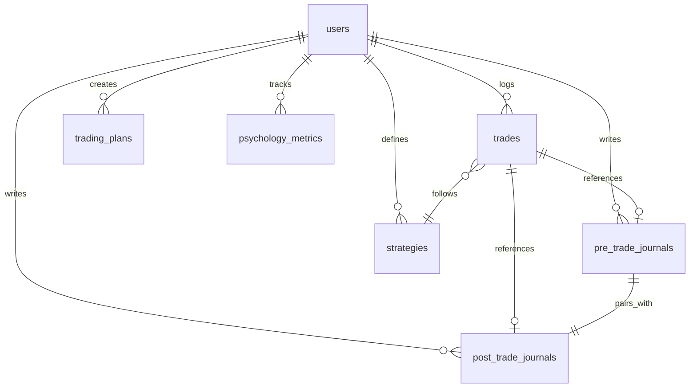
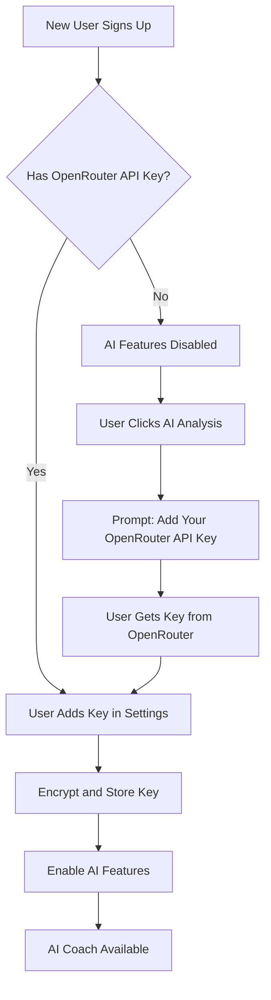
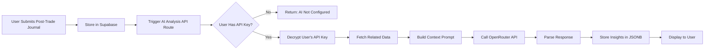
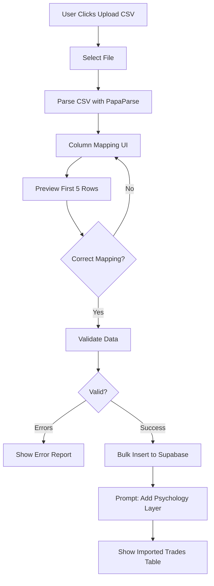

# Trading Journal Architecture Document
## "The Mindful Trader" - Psychology-First Trading Journal

**Version:** 1.1
**Last Updated:** 2026-02-07
**Target Deployment:** Railway
**Core Philosophy:** "Trade the market, not your emotions" - Inspired by Mark Douglas and Dr. Alexander Elder

---

## ✅ Configuration Decisions

**Database:** Supabase (Hosted PostgreSQL)
- Project URL: `https://pkgnikqykdqdhlqvxrxa.supabase.co`
- Region: United States

**AI Provider:** OpenRouter (User-Provided API Keys)
- Users must provide their own OpenRouter API key to use AI features
- Supports multiple models (GPT-4, Claude, etc.) based on user preference
- Admin API key available for testing (stored securely in Railway environment variables)

**Authentication:** Supabase Auth (Email/Password Only)
- Simple email and password signup/login
- User profiles stored in Supabase

**Mobile Strategy:** Responsive Web App (React)
- Mobile-first design with Tailwind CSS breakpoints
- Progressive Web App (PWA) capabilities

**Monetization:** Free (No Premium Features Yet)

**Data Privacy:** United States region, compliant with US regulations

---

## Table of Contents
1. [Project Vision](#project-vision)
2. [Core Principles](#core-principles)
3. [Technology Stack](#technology-stack)
4. [Database Architecture](#database-architecture)
5. [Psychology Framework](#psychology-framework)
6. [Feature Roadmap](#feature-roadmap)
7. [UI/UX Design Philosophy](#uiux-design-philosophy)
8. [AI Coach Architecture](#ai-coach-architecture)
9. [CSV Import System](#csv-import-system)
10. [Railway Deployment](#railway-deployment)

---

## Project Vision

### Problem Statement
Current trading journals are **data graveyards** - they collect information but provide no insight into the trader's psychological patterns, rule adherence, or behavioral evolution. Traders abandon journaling because:
- It's tedious (manual entry fatigue)
- It's not rewarding (no immediate feedback)
- It lacks actionable insights (just data, no wisdom)

### Solution
A **psychology-first trading journal** that:
- Makes journaling **rewarding** through instant insights and beautiful visualizations
- Uses **AI analysis** to detect emotional patterns (FOMO, revenge trading, overconfidence)
- Gamifies **self-awareness** rather than P&L (reward the process, not just results)
- Implements principles from "Trading in the Zone" and "Trading for a Living"

### Key Differentiators
1. **Pre-Trade + Post-Trade Journaling** (capture your state before AND after)
2. **Psychology-Driven Metrics** (track discipline score, rule adherence, emotional state)
3. **AI Coach** that analyzes your notes for patterns you can't see
4. **Reward Journaling** with infographics, badges, and psychological insights
5. **CSV Import** to reduce friction (import broker data, add psychology layer)

---

## Core Principles

### 1. Trading Psychology Foundations

#### From "Trading in the Zone" (Mark Douglas)
- **Probabilistic Thinking**: Track your edge statistically, not emotionally
- **Consistency Over Perfection**: Reward executing your plan, win or lose
- **Belief System Tracking**: Monitor if your actions align with your trading beliefs

#### From "Trading for a Living" (Dr. Alexander Elder)
- **The Three M's**: Mind (psychology), Method (strategy), Money (risk management)
- **Emotional Temperature**: Track your mental state before trading
- **The 2% Rule**: Enforce position sizing discipline
- **The Triple Screen**: Strategy validation and confluence tracking

### 2. Gamification Philosophy
**DO:**
- ✅ Reward journaling consistency (daily streaks)
- ✅ Reward rule adherence (even on losing trades)
- ✅ Reward self-awareness (honest emotional tags)
- ✅ Celebrate milestones (100 trades logged, 30-day streak)

**DON'T:**
- ❌ Gamify P&L (avoid encouraging gambling mentality)
- ❌ Create competitive leaderboards (you vs. your past self only)
- ❌ Reward revenge trading or overtrading

### 3. Design Philosophy
- **Mobile-First**: Log trades immediately after execution
- **Dark Mode Fintech Aesthetic**: Reduce eye strain, professional appearance
- **Visual Feedback**: Instant charts and infographics on every journal entry
- **Scannability**: Green/Red color coding, clear visual hierarchy

---

## Technology Stack

### Frontend
- **Framework**: Next.js 15+ (App Router, TypeScript)
- **Styling**: Tailwind CSS + Shadcn/UI
- **Charts**: 
  - TradingView Lightweight Charts (price action visualization)
  - Recharts (analytics dashboard, equity curve)
- **Forms**: React Hook Form + Zod (type-safe validation)
- **State**: Zustand (lightweight, no Redux overhead)
- **Mobile**: Responsive design (Tailwind breakpoints)

### Backend
- **Runtime**: Next.js API Routes (serverless functions)
- **Database**: Supabase (PostgreSQL + Realtime + Auth + Storage)
  - Project: `https://pkgnikqykdqdhlqvxrxa.supabase.co`
  - Authentication: Email/password via Supabase Auth
  - File Storage: Chart screenshots, CSV uploads
- **AI**: OpenRouter API (user-provided keys)
  - Supports multiple models: GPT-4, Claude, Llama, etc.
  - Users bring their own API keys for AI features
  - Admin key for testing (Railway environment variable)

### DevOps
- **Hosting**: Railway (Next.js + PostgreSQL)
- **Environment**: Railway environment variables
- **CI/CD**: GitHub → Railway auto-deploy
- **Monitoring**: Railway metrics + Supabase dashboard

### Key Dependencies
```json
{
  "dependencies": {
    "next": "^15.0.0",
    "react": "^18.2.0",
    "typescript": "^5.3.0",
    "tailwindcss": "^3.4.0",
    "@supabase/supabase-js": "^2.39.0",
    "@supabase/auth-helpers-nextjs": "^0.10.0",
    "lightweight-charts": "^4.1.0",
    "recharts": "^2.10.0",
    "react-hook-form": "^7.49.0",
    "zod": "^3.22.0",
    "zustand": "^4.4.0",
    "openai": "^4.20.0",
    "papaparse": "^5.4.0",
    "date-fns": "^3.0.0",
    "lucide-react": "^0.300.0"
  }
}
```

---

## Database Architecture

### Schema Overview



### Core Tables

#### 1. `user_profiles` (Extended User Data)
```sql
-- Extended user profile
CREATE TABLE user_profiles (
  id UUID PRIMARY KEY REFERENCES auth.users(id) ON DELETE CASCADE,
  display_name TEXT,
  email TEXT NOT NULL UNIQUE,
  timezone TEXT DEFAULT 'America/Los_Angeles',
  trading_style TEXT CHECK (trading_style IN ('day_trader', 'swing_trader', 'position_trader', 'investor')),
  
  -- Risk Management Settings
  risk_per_trade_percent DECIMAL(4,2) DEFAULT 1.00,
  daily_loss_limit DECIMAL(10,2),
  weekly_loss_limit DECIMAL(10,2),
  account_balance DECIMAL(12,2),
  
  -- AI Configuration (User's Own API Key)
  openrouter_api_key TEXT, -- Encrypted at application level before storage
  preferred_ai_model TEXT DEFAULT 'openai/gpt-4-turbo', -- openrouter model ID
  ai_features_enabled BOOLEAN DEFAULT FALSE, -- TRUE when user provides API key
  
  created_at TIMESTAMPTZ DEFAULT NOW(),
  updated_at TIMESTAMPTZ DEFAULT NOW()
);

-- Index for fast email lookup
CREATE INDEX idx_user_profiles_email ON user_profiles(email);
```

**Security Note:** The `openrouter_api_key` field should be encrypted before storing in the database. Use a library like `@supabase/supabase-js` with encryption helpers or encrypt/decrypt in your API routes using a secret key stored in Railway environment variables.

#### 2. `strategies`
```sql
CREATE TABLE strategies (
  id UUID PRIMARY KEY DEFAULT gen_random_uuid(),
  user_id UUID REFERENCES user_profiles(id) ON DELETE CASCADE,
  name TEXT NOT NULL, -- e.g., "Bull Flag Breakout"
  description TEXT,
  setup_criteria JSONB, -- Checklist: {"higher_timeframe_trend": "bullish", "volume": "above_average"}
  entry_rules TEXT,
  exit_rules TEXT,
  risk_reward_target DECIMAL(4,2),
  win_rate_target DECIMAL(5,2),
  created_at TIMESTAMPTZ DEFAULT NOW(),
  updated_at TIMESTAMPTZ DEFAULT NOW()
);
```

#### 3. `pre_trade_journals` (Before Trade Execution)
```sql
CREATE TABLE pre_trade_journals (
  id UUID PRIMARY KEY DEFAULT gen_random_uuid(),
  user_id UUID REFERENCES user_profiles(id) ON DELETE CASCADE,
  trade_id UUID REFERENCES trades(id) ON DELETE CASCADE,
  
  -- Emotional State (Elder's "Emotional Temperature")
  emotional_state TEXT[] DEFAULT '{}', -- ['confident', 'anxious', 'neutral', 'FOMO', 'revenge']
  emotional_score INTEGER CHECK (emotional_score BETWEEN 1 AND 10), -- 1=fearful, 10=euphoric, 5=neutral
  
  -- Market Analysis
  market_bias TEXT CHECK (market_bias IN ('bullish', 'bearish', 'neutral', 'choppy')),
  spy_trend TEXT CHECK (spy_trend IN ('uptrend', 'downtrend', 'sideways')),
  sector_context TEXT, -- "Tech sector showing strength"
  
  -- Trade Setup Validation
  strategy_id UUID REFERENCES strategies(id),
  setup_quality INTEGER CHECK (setup_quality BETWEEN 1 AND 5), -- How well does this match my playbook?
  confluence_factors TEXT[], -- ['200MA support', 'bullish divergence', 'volume spike']
  
  -- Pre-Trade Checklist (Douglas: "Consistency")
  checklist JSONB, -- {"higher_tf_aligned": true, "position_size_correct": true, "stop_loss_set": true}
  
  -- Planned Trade Parameters
  planned_entry DECIMAL(10,4),
  planned_stop_loss DECIMAL(10,4),
  planned_target DECIMAL(10,4),
  planned_risk_reward DECIMAL(4,2),
  planned_position_size INTEGER,
  planned_risk_amount DECIMAL(10,2),
  
  -- Notes
  thesis TEXT, -- "Expecting bounce off 200MA after bullish engulfing"
  concerns TEXT, -- "Market has been choppy, could fake breakout"
  
  created_at TIMESTAMPTZ DEFAULT NOW()
);
```

#### 4. `trades` (Core Trade Data)
```sql
CREATE TABLE trades (
  id UUID PRIMARY KEY DEFAULT gen_random_uuid(),
  user_id UUID REFERENCES user_profiles(id) ON DELETE CASCADE,
  
  -- Basic Trade Info
  ticker TEXT NOT NULL,
  direction TEXT NOT NULL CHECK (direction IN ('long', 'short')),
  strategy_id UUID REFERENCES strategies(id),
  
  -- Execution Data
  entry_date TIMESTAMPTZ NOT NULL,
  exit_date TIMESTAMPTZ,
  entry_price DECIMAL(10,4) NOT NULL,
  exit_price DECIMAL(10,4),
  quantity INTEGER NOT NULL,
  
  -- Costs
  commissions DECIMAL(8,2) DEFAULT 0,
  slippage DECIMAL(8,2) DEFAULT 0,
  
  -- P&L Calculations (computed)
  gross_pnl DECIMAL(10,2),
  net_pnl DECIMAL(10,2),
  return_percent DECIMAL(6,2),
  
  -- Risk Management
  initial_stop_loss DECIMAL(10,4),
  actual_stop_loss DECIMAL(10,4), -- Did you move it?
  risk_amount DECIMAL(10,2),
  reward_amount DECIMAL(10,2),
  actual_rr DECIMAL(4,2), -- Actual R:R achieved
  
  -- Trade Metadata
  hold_duration_minutes INTEGER,
  market_conditions TEXT[], -- ['trending', 'volatile', 'pre_market']
  screenshot_url TEXT, -- Chart screenshot from Supabase Storage
  
  -- CSV Import Flag
  imported_from_csv BOOLEAN DEFAULT FALSE,
  
  created_at TIMESTAMPTZ DEFAULT NOW(),
  updated_at TIMESTAMPTZ DEFAULT NOW()
);

-- Indexes for performance
CREATE INDEX idx_trades_user_date ON trades(user_id, entry_date DESC);
CREATE INDEX idx_trades_ticker ON trades(ticker);
CREATE INDEX idx_trades_strategy ON trades(strategy_id);
```

#### 5. `post_trade_journals` (After Trade Exit)
```sql
CREATE TABLE post_trade_journals (
  id UUID PRIMARY KEY DEFAULT gen_random_uuid(),
  user_id UUID REFERENCES user_profiles(id) ON DELETE CASCADE,
  trade_id UUID REFERENCES trades(id) ON DELETE CASCADE,
  pre_trade_journal_id UUID REFERENCES pre_trade_journals(id),
  
  -- Emotional State Post-Trade
  emotional_state TEXT[] DEFAULT '{}', -- ['relieved', 'regret', 'validated', 'frustrated']
  emotional_score INTEGER CHECK (emotional_score BETWEEN 1 AND 10),
  
  -- Execution Analysis
  execution_quality INTEGER CHECK (execution_quality BETWEEN 1 AND 5), -- How well did I execute?
  followed_plan BOOLEAN, -- Did I stick to my pre-trade plan?
  rule_violations TEXT[], -- ['moved_stop_loss', 'oversized_position', 'exited_early']
  
  -- What Went Right/Wrong
  what_went_well TEXT,
  what_went_wrong TEXT,
  lessons_learned TEXT,
  
  -- AI Analysis Prompt
  reflection_notes TEXT, -- Free-form journaling for AI analysis
  ai_analysis_completed BOOLEAN DEFAULT FALSE,
  ai_insights JSONB, -- Stored AI analysis: {"detected_patterns": [...], "recommendations": [...]}
  
  -- Would You Take This Trade Again?
  would_repeat BOOLEAN,
  repeat_reasoning TEXT,
  
  created_at TIMESTAMPTZ DEFAULT NOW()
);
```

#### 6. `psychology_metrics` (Aggregated Insights)
```sql
CREATE TABLE psychology_metrics (
  id UUID PRIMARY KEY DEFAULT gen_random_uuid(),
  user_id UUID REFERENCES user_profiles(id) ON DELETE CASCADE,
  
  -- Time Period
  period_start DATE NOT NULL,
  period_end DATE NOT NULL,
  
  -- Behavioral Metrics
  discipline_score INTEGER CHECK (discipline_score BETWEEN 0 AND 100),
  rule_adherence_rate DECIMAL(5,2), -- % of trades that followed rules
  fomo_trade_count INTEGER DEFAULT 0,
  revenge_trade_count INTEGER DEFAULT 0,
  
  -- Emotional Patterns
  most_common_pre_trade_emotion TEXT,
  most_common_post_trade_emotion TEXT,
  emotional_volatility DECIMAL(5,2), -- Std dev of emotional scores
  
  -- Performance Correlations
  disciplined_trade_win_rate DECIMAL(5,2),
  fomo_trade_win_rate DECIMAL(5,2),
  
  created_at TIMESTAMPTZ DEFAULT NOW()
);
```

#### 7. `trading_plans` (Daily/Weekly Plans)
```sql
CREATE TABLE trading_plans (
  id UUID PRIMARY KEY DEFAULT gen_random_uuid(),
  user_id UUID REFERENCES user_profiles(id) ON DELETE CASCADE,
  
  plan_date DATE NOT NULL,
  market_outlook TEXT,
  watchlist JSONB, -- [{"ticker": "AAPL", "trigger": "breakout above 180"}]
  max_trades_allowed INTEGER,
  max_loss_limit DECIMAL(10,2),
  focus_strategies TEXT[],
  personal_reminders TEXT[], -- ["Wait for confirmation", "Don't chase"]
  
  created_at TIMESTAMPTZ DEFAULT NOW(),
  updated_at TIMESTAMPTZ DEFAULT NOW(),
  
  UNIQUE(user_id, plan_date)
);
```

#### 8. `gamification` (Achievements & Streaks)
```sql
CREATE TABLE gamification (
  id UUID PRIMARY KEY DEFAULT gen_random_uuid(),
  user_id UUID REFERENCES user_profiles(id) ON DELETE CASCADE,
  
  -- Streaks
  current_journaling_streak INTEGER DEFAULT 0,
  longest_journaling_streak INTEGER DEFAULT 0,
  last_journal_date DATE,
  
  -- Milestones
  total_trades_logged INTEGER DEFAULT 0,
  total_days_journaled INTEGER DEFAULT 0,
  
  -- Badges Earned
  badges JSONB DEFAULT '[]', -- [{"badge": "100_trades", "earned_at": "2026-01-15"}]
  
  updated_at TIMESTAMPTZ DEFAULT NOW()
);
```

### Views for Analytics

```sql
-- Performance Summary View
CREATE VIEW trade_performance_summary AS
SELECT 
  user_id,
  COUNT(*) as total_trades,
  SUM(CASE WHEN net_pnl > 0 THEN 1 ELSE 0 END) as winning_trades,
  SUM(CASE WHEN net_pnl < 0 THEN 1 ELSE 0 END) as losing_trades,
  ROUND(100.0 * SUM(CASE WHEN net_pnl > 0 THEN 1 ELSE 0 END) / NULLIF(COUNT(*), 0), 2) as win_rate,
  SUM(CASE WHEN net_pnl > 0 THEN net_pnl ELSE 0 END) as total_wins,
  ABS(SUM(CASE WHEN net_pnl < 0 THEN net_pnl ELSE 0 END)) as total_losses,
  ROUND(SUM(CASE WHEN net_pnl > 0 THEN net_pnl ELSE 0 END) / NULLIF(ABS(SUM(CASE WHEN net_pnl < 0 THEN net_pnl ELSE 0 END)), 0), 2) as profit_factor,
  AVG(actual_rr) as avg_risk_reward,
  SUM(net_pnl) as total_pnl
FROM trades
WHERE exit_date IS NOT NULL
GROUP BY user_id;

-- Psychology Correlation View
CREATE VIEW psychology_performance_correlation AS
SELECT 
  t.user_id,
  ptj.emotional_state,
  COUNT(*) as trade_count,
  ROUND(100.0 * SUM(CASE WHEN t.net_pnl > 0 THEN 1 ELSE 0 END) / COUNT(*), 2) as win_rate,
  AVG(t.net_pnl) as avg_pnl
FROM trades t
JOIN pre_trade_journals ptj ON t.id = ptj.trade_id
WHERE t.exit_date IS NOT NULL
GROUP BY t.user_id, ptj.emotional_state;
```

---

## Psychology Framework

### Elder's "Three M's" Implementation

#### 1. Mind (Psychology Tracking)
**Pre-Trade Emotional Check-In:**
- Emotional State Tags: `['confident', 'anxious', 'neutral', 'FOMO', 'revenge', 'overconfident']`
- Emotional Score (1-10 scale): Visual slider with emoji indicators
- Requirement: Must complete before entering trade

**Post-Trade Reflection:**
- Execution Quality Rating
- Rule Violations Checklist
- "Would I take this trade again?" Boolean + reasoning

**AI Pattern Detection:**
- Identify emotional triggers: "You've taken 5 FOMO trades this week - all losses"
- Correlation analysis: "Your best trades occur when emotional score is 4-6 (calm confidence)"

#### 2. Method (Strategy Validation)
**Strategy Playbook:**
- Define each strategy with entry/exit criteria
- Track setup quality (1-5 stars) for each trade
- Measure actual win rate vs. expected win rate per strategy

**Confluence Tracking:**
- Multi-timeframe alignment
- Volume confirmation
- Support/resistance levels

#### 3. Money (Risk Management)
**Position Sizing Enforcement:**
- Set max risk per trade (e.g., 1% of account)
- Auto-calculate position size based on stop distance
- Alert if position exceeds limits

**Drawdown Protection:**
- Daily loss limit (Elder's 2% rule)
- Weekly loss limit (6% rule)
- Automatic "trading suspension" after threshold hit

### Douglas's "Probabilistic Thinking" Implementation

#### Expectancy Calculation
```
Expectancy = (Win Rate × Avg Win) - (Loss Rate × Avg Loss)
```

**Dashboard Metrics:**
- Your Edge: Display expectancy per strategy
- Sample Size Tracking: "50 more trades needed for statistical significance"
- Consistency Score: % of trades that followed your plan (win or lose)

#### Belief System Audit
**Weekly Reflection Prompts:**
- "Did I trust my process this week?"
- "Did I let fear prevent me from taking valid setups?"
- "Did I exit winners too early due to lack of confidence?"

**AI Analysis:**
- Detect contradictions: "You say you believe in letting winners run, but your avg win is 1R vs avg loss of 1.5R"

---

## Feature Roadmap

### Phase 1: MVP (Weeks 1-4)
**Goal:** Core journaling functionality with instant gratification

#### Features:
1. **Authentication** (Supabase Auth)
   - Email/password signup and login
   - Password reset via email
   - Email verification (optional)
   
2. **Trade Entry Form**
   - Basic fields: Ticker, direction, entry/exit, P&L
   - Strategy selector
   - Emotional state tags (quick select buttons)
   - Screenshot upload

3. **Dashboard View**
   - Recent trades table (sortable, filterable)
   - Basic metrics cards:
     - Total P&L (big, prominent)
     - Win Rate
     - Profit Factor
     - Total Trades
   - Equity curve chart (Recharts line chart)

4. **Pre-Trade Journal** (Simplified)
   - Emotional state (quick tags)
   - Setup quality (star rating)
   - Planned entry/stop/target
   - Short thesis (text area)

5. **Post-Trade Journal** (Simplified)
   - Did you follow your plan? (Yes/No)
   - What went well/wrong (text areas)
   - Lessons learned

6. **CSV Import**
   - Upload broker CSV
   - Map columns (ticker, entry, exit, quantity, P&L)
   - Bulk import trades
   - Prompt to add psychology layer after import

7. **Dark Mode UI**
   - Fintech aesthetic (dark bg, subtle gradients)
   - Green/red color coding for P&L
   - Mobile-responsive (Tailwind breakpoints)

#### Tech Setup:
- Initialize Next.js project
- Set up Supabase (PostgreSQL, Auth, Storage)
- Install Shadcn/UI components
- Configure Tailwind with custom fintech theme
- Set up Railway deployment

**Success Metrics:**
- User can log a trade in < 2 minutes
- Dashboard loads in < 1 second
- Mobile usable on phone (no horizontal scroll)

---

### Phase 2: Psychology Engine (Weeks 5-8)
**Goal:** Add AI-powered insights and gamification

#### Features:
1. **AI Coach Integration**
   - OpenAI GPT-4 API integration
   - Analyze post-trade notes for:
     - Emotional patterns (FOMO, revenge trading)
     - Rule violations (stop loss moves, position sizing)
     - Self-awareness gaps ("You say you're disciplined, but...")
   - Weekly summary email: "Your Trading Psychology Report"

2. **Psychology Dashboard**
   - Emotion vs. Performance chart (bar chart showing win rate by emotion)
   - Rule adherence trend (line chart over time)
   - Discipline score (0-100, based on rule following)
   - Most common mistakes (word cloud or bar chart)

3. **Gamification System**
   - Journaling streak tracker (fire emoji like Duolingo)
   - Badges:
     - "Journaling Junkie" (30-day streak)
     - "100 Trades" milestone
     - "Rule Follower" (90% adherence for a week)
     - "Calm Confidence" (5 trades with emotional score 4-6)
   - Progress bars for next milestone

4. **Infographic Auto-Generation**
   - After every trade: Generate beautiful card with:
     - Trade result (P&L, R:R)
     - Emotional state visualization
     - "Your Best Trades" comparison
   - Shareable image (Twitter, Discord)

5. **Strategy Performance Breakdown**
   - Table: Each strategy with win rate, profit factor, sample size
   - Filter trades by strategy
   - Visual indicator: "Needs more data" if < 30 trades

**Success Metrics:**
- AI analysis provides at least 1 actionable insight per week
- Users return to see gamification progress (30% weekly active users)
- Avg trades logged per user increases by 50%

---

### Phase 3: Advanced Analytics (Weeks 9-12)
**Goal:** Deep dives into performance patterns

#### Features:
1. **Time-Based Analysis**
   - Heatmap: Win rate by day of week
   - Heatmap: Win rate by hour of day (day traders)
   - Avoid list: "You lose money trading on Fridays after 2pm"

2. **Market Context Correlation**
   - Performance when SPY is trending vs. choppy
   - Performance by sector (if trading stocks)
   - Filter: "Show only trades where SPY was in uptrend"

3. **Advanced Charts**
   - TradingView Lightweight Charts integration
   - Mark entry/exit points on price chart
   - Overlay: Where you should have entered vs. where you did

4. **Trade Review Mode**
   - Slide deck view: One trade per slide
   - Compare: Pre-trade plan vs. actual execution
   - Annotation tool: Draw on charts

5. **Exporting & Reporting**
   - PDF trade journal export (for taxes, mentor review)
   - Custom date range reports
   - Share specific trades (obfuscated ticker if desired)

**Success Metrics:**
- Users discover at least 1 "avoid pattern" (e.g., Friday afternoon trades)
- 20% of users export a report

---

### Phase 4: Real-Time & Social (Weeks 13-16)
**Goal:** Pre-trade planning and community accountability

#### Features:
1. **Daily Trading Plan**
   - Morning checklist: Market outlook, watchlist, max trades
   - Personal reminders: "Wait for confirmation" (sticky note style)
   - End-of-day review: Did you stick to the plan?

2. **Pre-Market Watchlist**
   - Add tickers with triggers: "AAPL breakout above 180"
   - Optional: Notify when price approaches trigger (via webhook or email)

3. **Real-Time Position Tracking** (Optional)
   - Log trade when entering (before exit)
   - Update status: "In trade", "Exited"
   - Live P&L (if integrated with broker API - future scope)

4. **Accountability Features**
   - Mentor Mode: Share journal access with coach (read-only)
   - Anonymous sharing: Post trade to community for feedback
   - Public stats: Show "consistency score" without exposing trades

5. **Mobile App** (React Native or PWA)
   - Quick log form (minimize typing)
   - Voice-to-text for notes
   - Push notifications: "Don't forget to journal today!"

**Success Metrics:**
- 50% of users create a daily trading plan
- 10% of users enable mentor sharing
- Mobile traffic accounts for 40% of usage

---

## UI/UX Design Philosophy

### Mobile-First Principles

#### Critical User Flows (Mobile Optimized):
1. **Quick Trade Log** (< 30 seconds)
   - Large tap targets (min 44px)
   - Pre-filled defaults (last strategy, current emotional state)
   - Voice input for notes
   - Photo upload for chart screenshots

2. **Dashboard Glanceability** (< 5 seconds to understand)
   - Big numbers: Today's P&L, This Week's P&L
   - Color coding: Green = good, Red = bad, Yellow = neutral
   - Icons over text when possible

3. **Pre-Trade Checklist** (swipe through steps)
   - Wizard-style form (one question per screen)
   - Progress indicator at top
   - Final screen: "Ready to trade? Confirm your plan"

#### Responsive Breakpoints:
```css
/* Tailwind breakpoints */
sm: 640px   /* Small phone landscape */
md: 768px   /* Tablet portrait */
lg: 1024px  /* Tablet landscape / small laptop */
xl: 1280px  /* Desktop */
2xl: 1536px /* Large desktop */
```

**Layout Adaptations:**
- Mobile: Single column, bottom navigation
- Tablet: 2-column dashboard, side navigation
- Desktop: 3-column dashboard, persistent sidebar

### Dark Mode Fintech Aesthetic

#### Color Palette:
```typescript
const theme = {
  background: {
    primary: '#0a0e1a',      // Deep navy (main background)
    secondary: '#141b2d',    // Lighter navy (cards)
    tertiary: '#1f2940',     // Elevated surfaces
  },
  text: {
    primary: '#e0e6ed',      // Off-white (main text)
    secondary: '#8b92a7',    // Muted gray (labels)
    tertiary: '#5a607a',     // Dimmed gray (disabled)
  },
  accent: {
    profit: '#10b981',       // Green (wins, positive)
    loss: '#ef4444',         // Red (losses, negative)
    warning: '#f59e0b',      // Amber (caution)
    info: '#3b82f6',         // Blue (neutral info)
    purple: '#8b5cf6',       // Purple (psychology tags)
  },
  chart: {
    grid: '#252e42',         // Subtle grid lines
    axis: '#4a5568',         // Axis labels
    bull: '#10b981',         // Bullish candles
    bear: '#ef4444',         // Bearish candles
  }
}
```

#### Typography:
```css
/* Font Stack */
--font-sans: 'Inter', system-ui, sans-serif;  /* UI text */
--font-mono: 'JetBrains Mono', monospace;     /* Numbers, code */

/* Sizes */
--text-xs: 0.75rem;    /* 12px - labels */
--text-sm: 0.875rem;   /* 14px - body */
--text-base: 1rem;     /* 16px - default */
--text-lg: 1.125rem;   /* 18px - headings */
--text-xl: 1.25rem;    /* 20px - section titles */
--text-2xl: 1.5rem;    /* 24px - page titles */
--text-4xl: 2.25rem;   /* 36px - hero numbers (P&L) */
```

#### Component Patterns:

**Metric Card:**
```tsx
<Card className="bg-background-secondary border-accent-info/20">
  <CardHeader>
    <CardTitle className="text-text-secondary text-sm">Win Rate</CardTitle>
  </CardHeader>
  <CardContent>
    <div className="text-4xl font-mono text-accent-profit">68.5%</div>
    <div className="text-text-tertiary text-xs">↑ 5% from last week</div>
  </CardContent>
</Card>
```

**Trade Row (Table):**
```tsx
<TableRow className="hover:bg-background-tertiary/50 transition-colors">
  <TableCell className="font-mono">AAPL</TableCell>
  <TableCell>
    <Badge variant={direction === 'long' ? 'success' : 'destructive'}>
      {direction.toUpperCase()}
    </Badge>
  </TableCell>
  <TableCell className={cn(
    "font-mono text-right",
    pnl > 0 ? "text-accent-profit" : "text-accent-loss"
  )}>
    ${pnl.toFixed(2)}
  </TableCell>
</TableRow>
```

#### Micro-Interactions:
- **Hover states**: Subtle glow effect (box-shadow with accent color)
- **Loading states**: Skeleton screens (shimmer effect)
- **Success feedback**: Green checkmark animation + haptic on mobile
- **Streak counter**: Fire emoji with scale animation on increment

### Accessibility (WCAG 2.1 AA)
- Color contrast ratio > 4.5:1 for text
- Focus indicators on all interactive elements
- Screen reader labels on charts
- Keyboard navigation support
- Reduced motion option (disable animations)

---

## AI Coach Architecture

### OpenRouter Integration (User-Provided API Keys)

#### Why User-Provided Keys?
1. **Cost Transparency**: Users pay for their own AI usage directly
2. **Model Flexibility**: Users can choose any model supported by OpenRouter (GPT-4, Claude, Llama, etc.)
3. **Privacy**: No centralized API key means lower liability
4. **Scalability**: No need to manage AI costs as user base grows

#### User Experience Flow:


#### API Flow:


#### Prompt Engineering Strategy

**Context Window:**
```typescript
const buildAIPrompt = (trade, preJournal, postJournal, recentTrades) => {
  return `
You are a trading psychology coach inspired by Mark Douglas and Dr. Alexander Elder.

**Current Trade:**
- Ticker: ${trade.ticker}
- Result: ${trade.net_pnl > 0 ? 'Win' : 'Loss'} ($${trade.net_pnl})
- Strategy: ${trade.strategy}

**Pre-Trade State:**
- Emotional State: ${preJournal.emotional_state.join(', ')}
- Emotional Score: ${preJournal.emotional_score}/10
- Setup Quality: ${preJournal.setup_quality}/5
- Thesis: "${preJournal.thesis}"

**Post-Trade Reflection:**
- Followed Plan: ${postJournal.followed_plan ? 'Yes' : 'No'}
- Rule Violations: ${postJournal.rule_violations.join(', ') || 'None'}
- Reflection: "${postJournal.reflection_notes}"

**Recent Pattern (Last 10 Trades):**
${recentTrades.map(t => `${t.ticker}: ${t.net_pnl > 0 ? 'Win' : 'Loss'} (${t.pre_journal.emotional_state})`).join('\n')}

**Task:**
1. Identify emotional patterns (is FOMO recurring?)
2. Detect rule-breaking trends (stop loss violations?)
3. Provide 1-2 actionable insights to improve discipline
4. Be supportive but honest (not just cheerleading)

**Response Format (JSON):**
{
  "detected_patterns": ["string"],
  "emotional_insights": "string",
  "rule_adherence_feedback": "string",
  "actionable_recommendations": ["string"],
  "encouragement": "string"
}
`;
};
```

#### API Route Implementation with User Keys:
```typescript
// app/api/ai/analyze-trade/route.ts
import { createRouteHandlerClient } from '@supabase/auth-helpers-nextjs';
import { cookies } from 'next/headers';
import { decrypt } from '@/lib/encryption'; // Your encryption utility

export async function POST(request: Request) {
  const { tradeId } = await request.json();
  
  // Get authenticated user
  const supabase = createRouteHandlerClient({ cookies });
  const { data: { session } } = await supabase.auth.getSession();
  
  if (!session) {
    return Response.json({ error: 'Unauthorized' }, { status: 401 });
  }
  
  const userId = session.user.id;
  
  // Fetch user's API key and preferences
  const { data: profile } = await supabase
    .from('user_profiles')
    .select('openrouter_api_key, preferred_ai_model, ai_features_enabled')
    .eq('id', userId)
    .single();
  
  if (!profile?.ai_features_enabled || !profile?.openrouter_api_key) {
    return Response.json({
      error: 'AI features not configured',
      message: 'Please add your OpenRouter API key in Settings to use AI analysis'
    }, { status: 403 });
  }
  
  // Decrypt the user's API key
  const apiKey = decrypt(profile.openrouter_api_key);
  
  // Fetch trade + journals
  const { data: trade } = await supabase
    .from('trades')
    .select(`
      *,
      pre_trade_journals(*),
      post_trade_journals(*)
    `)
    .eq('id', tradeId)
    .eq('user_id', userId) // Ensure user owns this trade
    .single();
  
  if (!trade) {
    return Response.json({ error: 'Trade not found' }, { status: 404 });
  }
  
  // Fetch recent trades for pattern detection
  const { data: recentTrades } = await supabase
    .from('trades')
    .select('*, pre_trade_journals(*)')
    .eq('user_id', userId)
    .order('entry_date', { ascending: false })
    .limit(10);
  
  // Build prompt
  const prompt = buildAIPrompt(
    trade,
    trade.pre_trade_journals[0],
    trade.post_trade_journals[0],
    recentTrades
  );
  
  try {
    // Call OpenRouter API with user's key
    const response = await fetch('https://openrouter.ai/api/v1/chat/completions', {
      method: 'POST',
      headers: {
        'Authorization': `Bearer ${apiKey}`,
        'Content-Type': 'application/json',
        'HTTP-Referer': process.env.NEXT_PUBLIC_APP_URL,
        'X-Title': 'Trading Journal AI Coach',
      },
      body: JSON.stringify({
        model: profile.preferred_ai_model || 'openai/gpt-4-turbo',
        messages: [
          {
            role: 'system',
            content: 'You are a trading psychology expert inspired by Mark Douglas and Dr. Alexander Elder.'
          },
          { role: 'user', content: prompt }
        ],
        response_format: { type: 'json_object' },
        temperature: 0.7,
      }),
    });
    
    if (!response.ok) {
      const error = await response.json();
      throw new Error(error.error?.message || 'OpenRouter API error');
    }
    
    const data = await response.json();
    const insights = JSON.parse(data.choices[0].message.content);
    
    // Store insights
    await supabase
      .from('post_trade_journals')
      .update({
        ai_insights: insights,
        ai_analysis_completed: true
      })
      .eq('trade_id', tradeId);
    
    return Response.json({
      success: true,
      insights,
      model_used: profile.preferred_ai_model,
      cost: data.usage // OpenRouter returns token usage
    });
    
  } catch (error) {
    console.error('AI Analysis Error:', error);
    return Response.json({
      error: 'AI analysis failed',
      message: error.message
    }, { status: 500 });
  }
}
```

#### Encryption Utility:
```typescript
// lib/encryption.ts
import crypto from 'crypto';

const ENCRYPTION_KEY = process.env.ENCRYPTION_SECRET_KEY!; // 32 bytes, stored in Railway
const ALGORITHM = 'aes-256-gcm';

export function encrypt(text: string): string {
  const iv = crypto.randomBytes(16);
  const cipher = crypto.createCipheriv(ALGORITHM, Buffer.from(ENCRYPTION_KEY, 'hex'), iv);
  
  let encrypted = cipher.update(text, 'utf8', 'hex');
  encrypted += cipher.final('hex');
  
  const authTag = cipher.getAuthTag();
  
  // Return: iv:authTag:encrypted
  return `${iv.toString('hex')}:${authTag.toString('hex')}:${encrypted}`;
}

export function decrypt(encryptedData: string): string {
  const [ivHex, authTagHex, encrypted] = encryptedData.split(':');
  
  const decipher = crypto.createDecipheriv(
    ALGORITHM,
    Buffer.from(ENCRYPTION_KEY, 'hex'),
    Buffer.from(ivHex, 'hex')
  );
  
  decipher.setAuthTag(Buffer.from(authTagHex, 'hex'));
  
  let decrypted = decipher.update(encrypted, 'hex', 'utf8');
  decrypted += decipher.final('utf8');
  
  return decrypted;
}
```

#### Settings Page for API Key Management:
```typescript
// app/(dashboard)/settings/page.tsx
'use client';

import { useState } from 'react';
import { Button } from '@/components/ui/button';
import { Input } from '@/components/ui/input';
import { Alert, AlertDescription } from '@/components/ui/alert';

export default function SettingsPage() {
  const [apiKey, setApiKey] = useState('');
  const [selectedModel, setSelectedModel] = useState('openai/gpt-4-turbo');
  const [saving, setSaving] = useState(false);
  
  const handleSaveAPIKey = async () => {
    setSaving(true);
    
    try {
      const response = await fetch('/api/user/update-ai-config', {
        method: 'POST',
        headers: { 'Content-Type': 'application/json' },
        body: JSON.stringify({
          apiKey,
          preferredModel: selectedModel,
        }),
      });
      
      if (response.ok) {
        alert('API key saved successfully! AI features are now enabled.');
        setApiKey(''); // Clear input for security
      } else {
        const error = await response.json();
        alert(`Error: ${error.message}`);
      }
    } catch (error) {
      alert('Failed to save API key');
    } finally {
      setSaving(false);
    }
  };
  
  return (
    <div className="max-w-2xl mx-auto p-6">
      <h1 className="text-2xl font-bold mb-6">AI Configuration</h1>
      
      <Alert className="mb-6">
        <AlertDescription>
          To use AI coaching features, you need an OpenRouter API key.
          Get yours at <a href="https://openrouter.ai/keys" target="_blank" className="underline">
            openrouter.ai/keys
          </a>
        </AlertDescription>
      </Alert>
      
      <div className="space-y-4">
        <div>
          <label className="block text-sm font-medium mb-2">OpenRouter API Key</label>
          <Input
            type="password"
            placeholder="sk-or-v1-..."
            value={apiKey}
            onChange={(e) => setApiKey(e.target.value)}
            className="w-full"
          />
          <p className="text-xs text-gray-500 mt-1">
            Your API key is encrypted and never shared. You pay OpenRouter directly.
          </p>
        </div>
        
        <div>
          <label className="block text-sm font-medium mb-2">Preferred Model</label>
          <select
            value={selectedModel}
            onChange={(e) => setSelectedModel(e.target.value)}
            className="w-full p-2 border rounded"
          >
            <option value="openai/gpt-4-turbo">GPT-4 Turbo (Best quality)</option>
            <option value="anthropic/claude-3-opus">Claude 3 Opus</option>
            <option value="openai/gpt-3.5-turbo">GPT-3.5 Turbo (Faster, cheaper)</option>
            <option value="meta-llama/llama-3-70b-instruct">Llama 3 70B</option>
          </select>
        </div>
        
        <Button
          onClick={handleSaveAPIKey}
          disabled={!apiKey || saving}
          className="w-full"
        >
          {saving ? 'Saving...' : 'Save API Configuration'}
        </Button>
      </div>
    </div>
  );
}
```

### AI Features by Phase

#### Phase 2 (MVP):
- **Single trade analysis**: Analyze one post-trade journal at a time
- **Pattern detection**: Basic emotional pattern recognition
- **Weekly summary**: Email with top insights

#### Phase 3 (Advanced):
- **Comparative analysis**: "Your FOMO trades vs. disciplined trades"
- **Belief audit**: "You believe X, but your actions show Y"
- **Personalized recommendations**: "Based on your data, focus on..."

#### Phase 4 (Predictive):
- **Pre-trade warnings**: "Your emotional state suggests you might be tilting"
- **Setup validation**: "This trade doesn't match your best setups"
- **Habit formation**: "You're 3 days away from breaking your FOMO pattern"

### Privacy & Cost Considerations

**User-Controlled Costs:**
- Users pay OpenRouter directly based on their usage
- No markup or platform fees on AI usage
- Users can choose cheaper models (GPT-3.5, Llama) to save money
- Display estimated cost before running analysis

**API Key Security:**
- Keys encrypted with AES-256-GCM before storage
- Encryption key stored in Railway environment (not in code)
- Keys never logged or exposed in client-side code
- API key can be deleted anytime in settings

**Privacy:**
- API keys stay with user (no centralized OpenRouter account)
- Trade data sent to OpenRouter only when user initiates analysis
- No identifiable personal information sent to AI models
- Optional: Anonymize ticker symbols before sending to AI

**Admin/Test Key:**
- Store admin OpenRouter key in Railway for testing: `ADMIN_OPENROUTER_API_KEY`
- Use only when user doesn't have their own key (demo mode)
- Clearly indicate when using admin key (limited usage)

---

## CSV Import System

### User Flow



### Column Mapping Interface

**Supported Broker Formats:**
- Interactive Brokers
- TD Ameritrade (ThinkorSwim)
- E*TRADE
- TradeStation
- Custom format

**Required Fields:**
- Ticker/Symbol
- Entry Date/Time
- Exit Date/Time (or status: Open)
- Quantity
- Entry Price
- Exit Price (or current price)
- P&L (or calculate)

**Optional Fields:**
- Commissions
- Fees
- Strategy (map to user's strategies)
- Notes

### Implementation

```typescript
// app/components/CSVImport.tsx
const handleCSVUpload = async (file: File) => {
  // Parse CSV
  Papa.parse(file, {
    header: true,
    complete: async (results) => {
      setPreviewData(results.data.slice(0, 5));
      
      // Auto-detect columns
      const detectedMapping = detectColumns(results.meta.fields);
      setColumnMapping(detectedMapping);
      
      setStep('mapping');
    }
  });
};

const detectColumns = (headers: string[]) => {
  const mapping = {};
  
  headers.forEach(header => {
    const lower = header.toLowerCase();
    if (lower.includes('symbol') || lower.includes('ticker')) mapping.ticker = header;
    if (lower.includes('entry') && lower.includes('date')) mapping.entry_date = header;
    if (lower.includes('quantity') || lower.includes('qty')) mapping.quantity = header;
    // ... more detection logic
  });
  
  return mapping;
};

const importTrades = async () => {
  const trades = csvData.map(row => ({
    user_id: userId,
    ticker: row[columnMapping.ticker],
    entry_date: new Date(row[columnMapping.entry_date]),
    entry_price: parseFloat(row[columnMapping.entry_price]),
    quantity: parseInt(row[columnMapping.quantity]),
    // ... map other fields
    imported_from_csv: true,
  }));
  
  // Bulk insert
  const { data, error } = await supabase
    .from('trades')
    .insert(trades)
    .select();
  
  if (error) throw error;
  
  // Prompt to add psychology data
  setImportedTrades(data);
  setStep('add_psychology');
};
```

### Post-Import Workflow

**Psychology Layer Addition:**
After importing 50 trades from CSV, show:

```tsx
<Card>
  <CardHeader>
    <CardTitle>✅ 50 Trades Imported Successfully</CardTitle>
  </CardHeader>
  <CardContent>
    <p>Want to supercharge your journal with psychology insights?</p>
    
    <div className="space-y-2 mt-4">
      <Button onClick={bulkTagStrategies}>
        🎯 Tag Strategies (Which setups were these?)
      </Button>
      
      <Button onClick={bulkAddEmotions}>
        😌 Add Emotional Context (Quick survey)
      </Button>
      
      <Button onClick={analyzeWithAI}>
        🤖 Let AI Analyze Patterns
      </Button>
    </div>
  </CardContent>
</Card>
```

**Bulk Tagging UI:**
- Show trades grouped by ticker or date
- Quick-select: "All AAPL trades were 'Bull Flag' strategy"
- Checkbox: "I want to add notes to these later"

---

## Railway Deployment

### Project Structure for Railway

```
TradingJournal/
├── app/                    # Next.js app directory
├── components/             # React components
├── lib/                    # Utilities
├── public/                 # Static assets
├── supabase/               
│   └── migrations/         # SQL migration files
├── .env.local.example      # Template for env vars
├── railway.json            # Railway config (optional)
├── next.config.js
├── package.json
└── README.md
```

### Environment Variables (Railway)

**Supabase (Your Project):**
```env
NEXT_PUBLIC_SUPABASE_URL=https://pkgnikqykdqdhlqvxrxa.supabase.co
NEXT_PUBLIC_SUPABASE_ANON_KEY=sb_publishable_O74QarK7V1qLL4FFeZEDNA_1T4lv5Ue
SUPABASE_SERVICE_ROLE_KEY=your-service-role-key-here
```

**Encryption (For API Key Storage):**
```env
ENCRYPTION_SECRET_KEY=your-32-byte-hex-key-here
```

Generate encryption key with: `node -e "console.log(require('crypto').randomBytes(32).toString('hex'))"`

**OpenRouter (Admin Key for Testing - Optional):**
```env
ADMIN_OPENROUTER_API_KEY=sk-or-v1-your-key-here
```

**App Config:**
```env
NEXT_PUBLIC_APP_URL=https://your-app.railway.app
NODE_ENV=production
```

**Important:** Never commit `.env.local` to Git. Add to `.gitignore`.

### Railway Configuration

**railway.json:**
```json
{
  "$schema": "https://railway.app/railway.schema.json",
  "build": {
    "builder": "NIXPACKS"
  },
  "deploy": {
    "startCommand": "npm run start",
    "restartPolicyType": "ON_FAILURE",
    "restartPolicyMaxRetries": 10
  }
}
```

**Database Choice:**
- ✅ **Using Supabase Hosted PostgreSQL**
  - Project: `https://pkgnikqykdqdhlqvxrxa.supabase.co`
  - Includes Auth, Storage, Realtime, and dashboard
  - Free tier: 500MB database, 1GB file storage, 2GB bandwidth
  - No need for separate Railway database

### Deployment Steps

1. **Push to GitHub:**
   ```bash
   git init
   git add .
   git commit -m "Initial commit"
   git remote add origin https://github.com/yourusername/TradingJournal.git
   git push -u origin main
   ```

2. **Deploy to Railway:**
   - Create new project in Railway
   - Select "Deploy from GitHub repo"
   - Choose TradingJournal repository
   - Railway auto-detects Next.js and configures build

3. **Add Environment Variables:**
   - In Railway dashboard: Settings → Variables
   - Add all variables from `.env.local.example`

4. **Run Database Migrations:**
   - Option A: Use Supabase dashboard (SQL Editor)
   - Option B: Run migration script in Railway terminal

5. **Configure Custom Domain (Optional):**
   - Railway Settings → Domains
   - Add custom domain and update DNS

### CI/CD Pipeline

Railway automatically deploys on every push to `main` branch.

**Branching Strategy:**
- `main` → Production (Railway auto-deploy)
- `develop` → Staging environment (separate Railway service)
- `feature/*` → Local development

**GitHub Actions (Optional):**
```yaml
# .github/workflows/ci.yml
name: CI

on:
  pull_request:
    branches: [main, develop]

jobs:
  lint:
    runs-on: ubuntu-latest
    steps:
      - uses: actions/checkout@v3
      - uses: actions/setup-node@v3
        with:
          node-version: '18'
      - run: npm ci
      - run: npm run lint
      
  type-check:
    runs-on: ubuntu-latest
    steps:
      - uses: actions/checkout@v3
      - uses: actions/setup-node@v3
      - run: npm ci
      - run: npm run type-check
```

### Performance Optimization for Railway

**Next.js Config:**
```javascript
// next.config.js
module.exports = {
  output: 'standalone', // Reduces deployment size
  compress: true,
  images: {
    domains: ['pkgnikqykdqdhlqvxrxa.supabase.co'], // Your Supabase project
  },
  experimental: {
    serverActions: true,
  },
};
```

**Caching Strategy:**
- Static pages: Cache-Control headers
- API routes: Redis cache (Railway Redis plugin) for expensive queries
- Images: Supabase Storage CDN

### Monitoring & Logging

**Railway Metrics:**
- CPU usage
- Memory usage
- Request count
- Error rate

**Custom Logging (Optional):**
- Add Sentry for error tracking
- Add PostHog for user analytics

---

## File Structure

```
TradingJournal/
├── app/
│   ├── (auth)/
│   │   ├── login/
│   │   │   └── page.tsx
│   │   └── signup/
│   │       └── page.tsx
│   ├── (dashboard)/
│   │   ├── layout.tsx                 # Sidebar navigation
│   │   ├── page.tsx                   # Main dashboard
│   │   ├── trades/
│   │   │   ├── page.tsx               # Trades table
│   │   │   ├── new/
│   │   │   │   └── page.tsx           # Trade entry form
│   │   │   └── [id]/
│   │   │       ├── page.tsx           # Trade detail view
│   │   │       └── edit/
│   │   │           └── page.tsx       # Edit trade
│   │   ├── psychology/
│   │   │   └── page.tsx               # Psychology dashboard
│   │   ├── strategies/
│   │   │   ├── page.tsx               # Strategy manager
│   │   │   └── [id]/
│   │   │       └── page.tsx           # Strategy detail
│   │   ├── analytics/
│   │   │   └── page.tsx               # Advanced analytics
│   │   ├── import/
│   │   │   └── page.tsx               # CSV import
│   │   └── settings/
│   │       └── page.tsx               # User settings
│   ├── api/
│   │   ├── trades/
│   │   │   ├── route.ts               # GET, POST trades
│   │   │   └── [id]/
│   │   │       └── route.ts           # PUT, DELETE trade
│   │   ├── ai/
│   │   │   ├── analyze-trade/
│   │   │   │   └── route.ts           # Single trade analysis
│   │   │   └── weekly-summary/
│   │   │       └── route.ts           # Weekly insights
│   │   ├── import/
│   │   │   └── csv/
│   │   │       └── route.ts           # CSV upload handler
│   │   └── metrics/
│   │       └── route.ts               # Performance calculations
│   ├── layout.tsx                     # Root layout (providers)
│   └── globals.css                    # Tailwind imports
├── components/
│   ├── ui/                            # Shadcn components
│   │   ├── button.tsx
│   │   ├── card.tsx
│   │   ├── form.tsx
│   │   ├── table.tsx
│   │   └── ...
│   ├── trades/
│   │   ├── TradeEntryForm.tsx
│   │   ├── TradeTable.tsx
│   │   ├── TradeCard.tsx
│   │   └── PreTradeJournal.tsx
│   ├── dashboard/
│   │   ├── MetricCard.tsx
│   │   ├── EquityCurve.tsx
│   │   └── RecentTrades.tsx
│   ├── psychology/
│   │   ├── EmotionSelector.tsx
│   │   ├── DisciplineScore.tsx
│   │   └── EmotionPerformanceChart.tsx
│   ├── charts/
│   │   ├── TradingViewChart.tsx
│   │   ├── ProfitFactorChart.tsx
│   │   └── WinRateChart.tsx
│   ├── import/
│   │   ├── CSVUploader.tsx
│   │   ├── ColumnMapper.tsx
│   │   └── ImportPreview.tsx
│   └── layout/
│       ├── Sidebar.tsx
│       ├── TopNav.tsx
│       └── MobileNav.tsx
├── lib/
│   ├── supabase/
│   │   ├── client.ts                  # Browser client
│   │   ├── server.ts                  # Server client
│   │   └── types.ts                   # Generated types
│   ├── utils/
│   │   ├── calculations.ts            # Win rate, profit factor
│   │   ├── formatting.ts              # Currency, dates
│   │   └── validation.ts              # Zod schemas
│   ├── hooks/
│   │   ├── useTrades.ts               # SWR hook for trades
│   │   ├── useMetrics.ts              # Performance metrics
│   │   └── useGamification.ts         # Streak tracking
│   └── constants/
│       ├── emotions.ts                # Emotion tags list
│       ├── strategies.ts              # Default strategies
│       └── theme.ts                   # Color palette
├── supabase/
│   ├── migrations/
│   │   ├── 20260207000000_initial_schema.sql
│   │   ├── 20260207000001_rls_policies.sql
│   │   └── 20260207000002_views.sql
│   └── seed.sql                       # Sample data
├── public/
│   ├── images/
│   └── favicon.ico
├── .env.local.example
├── .gitignore
├── next.config.js
├── tailwind.config.ts
├── tsconfig.json
├── package.json
└── README.md
```

---

## Next Steps

### Immediate Actions (Before Development):

1. **Finalize Database Schema**
   - Review tables and relationships
   - Adjust based on your specific needs
   - Add any missing fields

2. **Design Mockups** (Optional but Recommended)
   - Sketch key screens (dashboard, trade form, psychology view)
   - Use Figma or even pencil/paper
   - Clarify user flow before coding

3. **Set Up Accounts**
   - Create Supabase project
   - Create Railway account
   - Get OpenAI API key

4. **Initialize Project**
   - Set up Next.js with TypeScript
   - Install dependencies
   - Configure Tailwind + Shadcn/UI

### Development Workflow:

**Week 1-2: Foundation**
- Initialize project
- Set up Supabase schema
- Create auth pages
- Build basic dashboard layout

**Week 3-4: Core Features**
- Trade entry form
- Trade table with filters
- Basic metrics calculation
- CSV import

**Week 5-6: Psychology Layer**
- Pre/post-trade journals
- Emotion tracking UI
- AI integration
- Gamification system

**Week 7-8: Polish & Deploy**
- Mobile responsiveness
- Error handling
- Testing
- Deploy to Railway

---

## ✅ Configuration Confirmed

All key decisions have been made:

1. **Database**: ✅ Supabase hosted PostgreSQL
   - Project URL: `https://pkgnikqykdqdhlqvxrxa.supabase.co`

2. **AI Provider**: ✅ OpenRouter with user-provided API keys
   - Users bring their own keys
   - Support for multiple models (GPT-4, Claude, Llama, etc.)
   - Admin key for testing

3. **Mobile**: ✅ Responsive React web app (mobile-first design)

4. **Authentication**: ✅ Email/password only (Supabase Auth)

5. **Monetization**: ✅ Free for all users

6. **Region**: ✅ United States (Supabase US region)

**Ready for implementation!** All architectural decisions are finalized.

---

## Conclusion

This architecture provides a **psychology-first, gamified trading journal** that solves the core problem of journaling fatigue. By making every journal entry immediately rewarding (through AI insights, infographics, and gamification), traders will actually **want** to use the system daily.

The phased approach allows you to:
1. Launch an MVP quickly (4 weeks)
2. Validate with real users
3. Iterate based on feedback
4. Scale to advanced features

The tech stack (Next.js + Supabase + Railway) is modern, scalable, and cost-effective for a solo developer or small team.

**Ready to build?** Let me know if you'd like to proceed with implementation or if you have any adjustments to the architecture!

---

**Document Maintained By:** AI Architect  
**Review Cycle:** Update after each major milestone  
**Feedback Welcome:** This is a living document - adjust as you learn from users!
