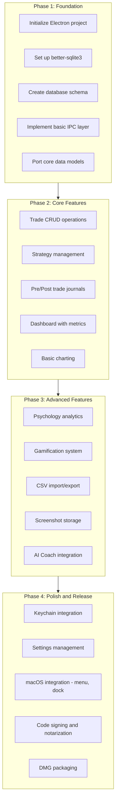

# Mac App Transition Feasibility Report
## The Mindful Trader - Web to Native Mac App Migration

**Version:** 1.0  
**Date:** 2026-02-09  
**Prepared for:** Personal Use  
**Current Platform:** Next.js 15 + Supabase (Hosted on Railway)

---

## Table of Contents

1. [Executive Summary](#1-executive-summary)
2. [Mac App Platform Options Analysis](#2-mac-app-platform-options-analysis)
3. [Local Database Solutions](#3-local-database-solutions)
4. [Feature-by-Feature Migration Complexity](#4-feature-by-feature-migration-complexity)
5. [Cost-Benefit Analysis](#5-cost-benefit-analysis)
6. [Recommended Approach](#6-recommended-approach)
7. [Risks and Mitigations](#7-risks-and-mitigations)
8. [Conclusion with Recommendation](#8-conclusion-with-recommendation)

---

## 1. Executive Summary

### Overall Feasibility Assessment: **HIGH**

Transitioning "The Mindful Trader" from a hosted web application to a native Mac app is **highly feasible** and aligns well with your goals of eliminating hosting costs and maintaining full data ownership.

### Key Findings

| Aspect | Assessment |
|--------|------------|
| **Technical Feasibility** | High - Existing React codebase is largely portable |
| **Code Reuse Potential** | 70-85% - UI components, calculations, and charts are fully reusable |
| **Database Migration** | Medium - SQLite can handle all current schema requirements |
| **Authentication Replacement** | Low Complexity - Local single-user app eliminates auth needs |
| **Development Effort** | Medium - Significant but manageable refactoring |

### Key Decision Points

1. **Platform Choice**: Electron (faster development) vs. Tauri (smaller bundles, native performance)
2. **Database**: SQLite (recommended) vs. local PostgreSQL
3. **Migration Strategy**: Full rewrite vs. incremental port
4. **Feature Scope**: Full parity vs. simplified MVP

### Strategic Recommendation

**Proceed with Electron + React + SQLite** for the initial Mac app. This approach maximizes code reuse, minimizes learning curve, and provides the fastest path to a working local application.

---

## 2. Mac App Platform Options Analysis

### Option A: Electron + React

**Description:** Package the existing React frontend in an Electron wrapper, replacing Supabase with local SQLite.

| Criterion | Rating | Notes |
|-----------|--------|-------|
| **Code Reuse** | ⭐⭐⭐⭐⭐ (95%) | All React components, hooks, and styling work as-is |
| **Development Speed** | ⭐⭐⭐⭐⭐ | Fastest time to working app |
| **Learning Curve** | ⭐⭐⭐⭐⭐ (Low) | Uses familiar web technologies |
| **Bundle Size** | ⭐⭐ | ~150-200MB (Chromium included) |
| **Performance** | ⭐⭐⭐ | Good, but higher memory usage |
| **Native Integration** | ⭐⭐⭐ | Possible via native Node modules |
| **macOS App Store** | ⭐⭐ | Possible but complex (sandbox restrictions) |

**Pros:**
- Maximum reuse of existing codebase
- Mature ecosystem with extensive documentation
- `better-sqlite3` works natively in Electron
- Hot-reload development experience
- Community support for common issues

**Cons:**
- Large app bundle size (~150-200MB)
- Higher RAM usage (~100-200MB idle)
- Not truly "native" feel
- Requires signing and notarization for distribution

**Key Libraries:**
- `electron` - App framework
- `electron-builder` - Packaging and distribution
- `better-sqlite3` - High-performance SQLite
- `electron-store` - Settings persistence
- All existing React dependencies work unchanged

---

### Option B: Tauri + React

**Description:** Use Tauri's Rust-based runtime with the existing React frontend, replacing heavy Electron with a lightweight native webview.

| Criterion | Rating | Notes |
|-----------|--------|-------|
| **Code Reuse** | ⭐⭐⭐⭐ (85%) | React UI works, but backend logic needs Rust rewrite |
| **Development Speed** | ⭐⭐⭐ | Moderate - Rust learning curve for backend |
| **Learning Curve** | ⭐⭐⭐ (Medium) | Requires Rust knowledge for database/IPC |
| **Bundle Size** | ⭐⭐⭐⭐⭐ | ~10-30MB (uses native WebKit) |
| **Performance** | ⭐⭐⭐⭐⭐ | Excellent, near-native performance |
| **Native Integration** | ⭐⭐⭐⭐⭐ | Full access to native APIs via Rust |
| **macOS App Store** | ⭐⭐⭐⭐ | Better compatibility with App Store requirements |

**Pros:**
- Tiny bundle size (10-30MB vs 150MB)
- Lower memory footprint (~30-50MB idle)
- Native performance for database operations
- Better security model (no Node.js surface area)
- Uses macOS native WebKit (always up-to-date)

**Cons:**
- Backend logic must be rewritten in Rust
- Steeper learning curve if unfamiliar with Rust
- Smaller community than Electron
- Some npm packages don't work (Node.js APIs)
- `encryption.ts` would need Rust equivalent

**Key Libraries:**
- `tauri` - App framework
- `rusqlite` - Rust SQLite bindings
- `serde` - JSON serialization in Rust
- All React frontend dependencies work unchanged

---

### Option C: Native SwiftUI

**Description:** Complete rewrite using Apple's native SwiftUI framework with Core Data or SQLite for persistence.

| Criterion | Rating | Notes |
|-----------|--------|-------|
| **Code Reuse** | ⭐ (5-10%) | Only business logic concepts transfer |
| **Development Speed** | ⭐⭐ | Slowest - complete rewrite required |
| **Learning Curve** | ⭐⭐ (High) | Must learn Swift, SwiftUI, Combine |
| **Bundle Size** | ⭐⭐⭐⭐⭐ | ~5-10MB |
| **Performance** | ⭐⭐⭐⭐⭐ | Best possible performance |
| **Native Integration** | ⭐⭐⭐⭐⭐ | Full access to all macOS APIs |
| **macOS App Store** | ⭐⭐⭐⭐⭐ | Best compatibility |

**Pros:**
- Smallest possible bundle size
- Best performance and battery efficiency
- Full native look and feel
- Best macOS integration (menu bar, notifications, widgets)
- Future-proof with Apple's platform direction
- Keychain integration for secure storage

**Cons:**
- Complete rewrite required (no code reuse)
- Must learn Swift/SwiftUI if not already familiar
- Longer development timeline
- No cross-platform potential
- Cannot reuse existing chart libraries (Recharts, lightweight-charts)

**Key Technologies:**
- SwiftUI for UI
- Core Data or GRDB/SQLite for database
- Combine for reactive patterns
- Swift Charts for analytics (iOS 16+/macOS 13+)

---

### Platform Comparison Matrix

| Feature | Electron | Tauri | SwiftUI |
|---------|----------|-------|---------|
| React Code Reuse | 95% | 85% | 0% |
| Bundle Size | 150-200MB | 10-30MB | 5-10MB |
| Memory Usage | 100-200MB | 30-50MB | 20-40MB |
| Development Time | Fastest | Medium | Slowest |
| Learning Curve | Lowest | Medium | Highest |
| Native Feel | Fair | Good | Excellent |
| Chart Library Support | Full | Full | Limited |
| Encryption | Node.js crypto | Rust crypto | CryptoKit |

---

## 3. Local Database Solutions

### Current Schema Complexity

The existing PostgreSQL schema includes:
- **8 Core Tables**: user_profiles, strategies, trades, pre_trade_journals, post_trade_journals, psychology_metrics, trading_plans, gamification
- **6 Analytics Views**: trade_performance_summary, psychology_performance_correlation, and time-based views
- **Complex Types**: JSONB columns for flexible data (checklists, badges, AI insights)
- **Array Columns**: TEXT[] for emotional_state, confluence_factors, market_conditions
- **Relationships**: Foreign keys between trades, journals, and strategies

---

### Option 1: SQLite with better-sqlite3 (Recommended for Electron)

**Migration Complexity: Medium**

| Aspect | Assessment |
|--------|------------|
| **JSONB Support** | ✅ Via JSON1 extension (enabled by default) |
| **Array Columns** | ⚠️ Store as JSON strings, deserialize in app |
| **Views** | ✅ Full SQL view support |
| **Performance** | ✅ Excellent for single-user workloads |
| **Encryption** | ✅ via SQLCipher (optional) |
| **Migrations** | ✅ Manual SQL scripts or `better-sqlite3-migrations` |

**Schema Changes Required:**
```sql
-- PostgreSQL TEXT[] → SQLite TEXT (JSON string)
-- emotional_state TEXT[] → emotional_state TEXT (JSON: '["confident", "FOMO"]')

-- PostgreSQL JSONB → SQLite TEXT
-- checklist JSONB → checklist TEXT (JSON string)

-- PostgreSQL gen_random_uuid() → Application-generated UUID
-- Use uuid library in Node.js

-- TIMESTAMPTZ → TEXT (ISO 8601 string) or INTEGER (Unix timestamp)
```

**Example Migration:**
```typescript
// lib/database/schema.ts
import Database from 'better-sqlite3';

const db = new Database('trading_journal.db');

db.exec(`
  CREATE TABLE IF NOT EXISTS trades (
    id TEXT PRIMARY KEY,
    user_id TEXT NOT NULL,
    ticker TEXT NOT NULL,
    direction TEXT CHECK (direction IN ('long', 'short')),
    strategy_id TEXT REFERENCES strategies(id),
    entry_date TEXT NOT NULL,
    exit_date TEXT,
    entry_price REAL NOT NULL,
    exit_price REAL,
    quantity INTEGER NOT NULL,
    commissions REAL DEFAULT 0,
    net_pnl REAL,
    screenshot_url TEXT,
    market_conditions TEXT, -- JSON array stored as string
    created_at TEXT DEFAULT (datetime('now')),
    updated_at TEXT DEFAULT (datetime('now'))
  );
`);
```

**Pros:**
- Zero-configuration embedded database
- Excellent performance for read-heavy workloads
- JSON1 extension handles JSONB replacement well
- Single file backup (just copy the .db file)
- Works perfectly in Electron

**Cons:**
- No native array types (use JSON strings)
- Manual UUID generation required
- Views may need minor syntax adjustments

---

### Option 2: sql.js (SQLite compiled to WebAssembly)

**Migration Complexity: Medium**

**Best for:** Browser-based or Tauri apps where native Node.js modules aren't available.

| Aspect | Assessment |
|--------|------------|
| **Node.js Required** | ❌ Works in pure browser/WebView |
| **Performance** | ⭐⭐⭐ Good, but slower than native SQLite |
| **Persistence** | ⚠️ Must manually save to IndexedDB/filesystem |
| **Encryption** | ❌ Not built-in (would need additional layer) |

**Pros:**
- No native compilation needed
- Works in any JavaScript environment
- Good for Tauri's WebView context

**Cons:**
- Slower than better-sqlite3 (WASM overhead)
- Manual persistence management
- Larger bundle size impact

---

### Option 3: Core Data (Native Swift Only)

**Migration Complexity: High**

**Best for:** Native SwiftUI applications.

| Aspect | Assessment |
|--------|------------|
| **Schema Definition** | Xcode model editor (.xcdatamodel) |
| **Query Language** | NSPredicate, NSFetchRequest |
| **Relationships** | Full ORM-style relationships |
| **iCloud Sync** | ✅ Built-in CloudKit integration |
| **Performance** | ✅ Excellent |

**Migration Approach:**
- Recreate all entities in Core Data model
- No direct SQL migration path
- Must manually map PostgreSQL types to Core Data types
- Relationships defined graphically in Xcode

**Pros:**
- Deep macOS integration
- iCloud sync capability
- Optimized for Apple platforms
- SwiftUI property wrappers (@FetchRequest)

**Cons:**
- Complete rewrite of data layer
- No SQL knowledge transfers
- Learning curve for Core Data concepts

---

### Option 4: Local PostgreSQL

**Migration Complexity: Low**

| Aspect | Assessment |
|--------|------------|
| **Schema Compatibility** | ✅ 100% identical to current |
| **Installation** | ⚠️ Requires PostgreSQL on user's Mac |
| **Resource Usage** | ⚠️ Heavy (~50-100MB RAM for server) |
| **Backup** | ✅ pg_dump works identically |

**Pros:**
- Zero schema changes required
- Views and functions work unchanged
- RLS policies can remain (though unnecessary for single-user)

**Cons:**
- Overkill for single-user application
- Complex installation/bundling
- Always-running background service
- Much heavier than SQLite

**Verdict:** Not recommended for this use case. SQLite is more appropriate.

---

### Database Recommendation Summary

| Solution | Recommended For | Migration Effort |
|----------|-----------------|------------------|
| **better-sqlite3** | Electron apps | Medium |
| **sql.js** | Tauri/browser apps | Medium |
| **Core Data** | Native SwiftUI | High |
| **Local PostgreSQL** | Not recommended | Low (but impractical) |

**Winner: better-sqlite3 with SQLite** - Best balance of compatibility, performance, and simplicity for an Electron-based Mac app.

---

## 4. Feature-by-Feature Migration Complexity

### Complexity Rating Legend
- 🟢 **Easy**: Direct port with minimal changes
- 🟡 **Medium**: Requires refactoring but concepts transfer
- 🔴 **Hard**: Significant rewrite or alternative approach needed

---

### Feature Migration Analysis

| Feature | Complexity | Notes |
|---------|------------|-------|
| **Trade CRUD Operations** | 🟢 Easy | Replace Supabase client with SQLite queries. All calculation logic in `calculations.ts` is pure JavaScript and works unchanged. |
| **Strategy Management** | 🟢 Easy | Simple table with JSONB for setup_criteria. Convert to JSON string in SQLite. |
| **Pre/Post Trade Journaling** | 🟢 Easy | TEXT[] arrays become JSON strings. All UI components unchanged. |
| **Psychology Metrics & Analytics** | 🟡 Medium | SQL views need translation to SQLite syntax. Recharts components work unchanged. |
| **Gamification (Streaks/Badges)** | 🟢 Easy | Simple logic, badges stored as JSON. Streak calculations in JavaScript. |
| **AI Coach Integration** | 🟡 Medium | OpenRouter API calls work unchanged. Remove user API key storage from database (use macOS Keychain or local encrypted file). |
| **CSV Import/Export** | 🟢 Easy | PapaParse works unchanged. File dialogs via Electron's dialog API. |
| **Chart Visualizations** | 🟢 Easy | Recharts and lightweight-charts are pure client-side. Zero changes needed. |
| **User Settings & Encryption** | 🔴 Hard | Node.js `crypto` needs adjustment for Electron's context. Consider using `electron-store` for settings and macOS Keychain for sensitive data. |
| **Authentication** | 🟢 Easy (Removed) | Single-user local app eliminates need for auth entirely. |
| **File Storage (Screenshots)** | 🟡 Medium | Replace Supabase Storage with local filesystem. Use Electron's `app.getPath('userData')` for storage location. |
| **Realtime Features** | N/A | Not applicable for local app |

---

### Detailed Feature Analysis

#### 1. Trade CRUD Operations
**Current Implementation:**
- Supabase client for CRUD operations
- [`useTrades.ts`](/Users/allanbranstiter/Documents/GitHub/TradingJournal/lib/hooks/useTrades.ts) hook for data fetching
- [`calculations.ts`](/Users/allanbranstiter/Documents/GitHub/TradingJournal/lib/utils/calculations.ts) for P&L calculations

**Migration Path:**
```typescript
// Before (Supabase)
const { data } = await supabase.from('trades').select('*').eq('user_id', userId);

// After (SQLite via Electron IPC)
const trades = await window.electronAPI.getTrades();

// Main process
ipcMain.handle('getTrades', () => {
  return db.prepare('SELECT * FROM trades ORDER BY entry_date DESC').all();
});
```

**Effort:** Minimal - Replace Supabase client calls with IPC calls to main process SQLite.

---

#### 2. Psychology Metrics & Analytics

**Current Implementation:**
- PostgreSQL views for aggregations
- [`usePsychologyMetrics.ts`](/Users/allanbranstiter/Documents/GitHub/TradingJournal/lib/hooks/usePsychologyMetrics.ts) hook
- Complex queries with GROUP BY and JOINs

**Migration Path:**
- Translate PostgreSQL views to SQLite-compatible syntax
- Some functions (e.g., `gen_random_uuid()`) need JavaScript alternatives
- Aggregation queries work with minor syntax adjustments

**Example View Translation:**
```sql
-- PostgreSQL (current)
CREATE VIEW trade_performance_summary AS
SELECT 
  user_id,
  COUNT(*) as total_trades,
  ROUND(100.0 * SUM(CASE WHEN net_pnl > 0 THEN 1 ELSE 0 END) / NULLIF(COUNT(*), 0), 2) as win_rate
FROM trades WHERE exit_date IS NOT NULL GROUP BY user_id;

-- SQLite (ported)
CREATE VIEW trade_performance_summary AS
SELECT 
  user_id,
  COUNT(*) as total_trades,
  ROUND(100.0 * SUM(CASE WHEN net_pnl > 0 THEN 1 ELSE 0 END) / MAX(COUNT(*), 1), 2) as win_rate
FROM trades WHERE exit_date IS NOT NULL GROUP BY user_id;
```

---

#### 3. AI Coach Integration

**Current Implementation:**
- OpenRouter API with user-provided keys
- Keys encrypted and stored in `user_profiles.openrouter_api_key`
- [`useAIAnalysis.ts`](/Users/allanbranstiter/Documents/GitHub/TradingJournal/lib/hooks/useAIAnalysis.ts) for AI interactions

**Migration Path:**
- OpenRouter API calls continue to work (HTTP requests from Electron)
- Store API key securely using `electron-keytar` (macOS Keychain) instead of database
- No encryption library needed - Keychain handles secure storage

```typescript
// Main process - secure key storage
import keytar from 'keytar';

ipcMain.handle('saveAPIKey', async (_, key: string) => {
  await keytar.setPassword('TradingJournal', 'openrouter', key);
});

ipcMain.handle('getAPIKey', async () => {
  return keytar.getPassword('TradingJournal', 'openrouter');
});
```

---

#### 4. User Settings & Encryption

**Current Implementation:**
- [`encryption.ts`](/Users/allanbranstiter/Documents/GitHub/TradingJournal/lib/encryption.ts) using Node.js `crypto`
- AES-256-GCM encryption for API keys
- Environment variable for encryption secret

**Challenge:**
- Node.js `crypto` module has different behavior in Electron renderer vs main process
- Encryption secret management in a local app is complex

**Migration Path:**
- **API Keys:** Use macOS Keychain via `electron-keytar` (no encryption needed)
- **Database Encryption:** Optional SQLCipher for full database encryption
- **Settings:** Use `electron-store` for non-sensitive preferences

**Verdict:** Simplification opportunity - Keychain eliminates need for custom encryption.

---

#### 5. File Storage (Screenshots)

**Current Implementation:**
- Supabase Storage bucket for chart screenshots
- URL references stored in `trades.screenshot_url`

**Migration Path:**
```typescript
// Main process
import { app, dialog } from 'electron';
import fs from 'fs';
import path from 'path';

const screenshotsDir = path.join(app.getPath('userData'), 'screenshots');

ipcMain.handle('saveScreenshot', async (_, buffer: Buffer, tradeId: string) => {
  const filename = `${tradeId}_${Date.now()}.png`;
  const filepath = path.join(screenshotsDir, filename);
  fs.writeFileSync(filepath, buffer);
  return `file://${filepath}`;
});
```

---

### Migration Complexity Summary

| Complexity | Features | Percentage |
|------------|----------|------------|
| 🟢 Easy | Trade CRUD, Strategies, Journaling, Gamification, CSV, Charts, Auth (removed) | 60% |
| 🟡 Medium | Psychology Analytics, AI Coach, File Storage | 30% |
| 🔴 Hard | Encryption/Security | 10% |

---

## 5. Cost-Benefit Analysis

### Current Hosting Costs (Estimated)

| Service | Monthly Cost | Annual Cost |
|---------|-------------|-------------|
| **Railway (Next.js hosting)** | $5-20 | $60-240 |
| **Supabase (Free tier)** | $0 | $0 |
| **Supabase (Pro tier if needed)** | $25 | $300 |
| **Domain (optional)** | $1-2 | $12-24 |
| **Total (Free tier)** | **$5-20** | **$60-240** |
| **Total (With Supabase Pro)** | **$30-45** | **$360-540** |

### Mac App Costs

| Category | One-Time | Ongoing |
|----------|----------|---------|
| **Apple Developer Program** | $99/year | $99/year (if distributing via App Store) |
| **Code Signing Certificate** | $0 | $0 (included in Developer Program) |
| **Hosting** | $0 | $0 |
| **Database** | $0 | $0 (local SQLite) |
| **Backups** | $0 | $0 (user's Time Machine/iCloud) |

### Development Effort Breakdown

| Phase | Scope |
|-------|-------|
| **Setup & Scaffolding** | Initialize Electron project, configure build tools, set up SQLite |
| **Database Migration** | Port schema, create migration scripts, implement database layer |
| **Core Feature Port** | Trade CRUD, journals, strategies, gamification |
| **Analytics Port** | Translate views, hook up chart components |
| **File Storage** | Local screenshot storage, path management |
| **Security** | Keychain integration, secure settings |
| **Testing & Polish** | Cross-platform testing, UX refinements |
| **Distribution** | Code signing, notarization, DMG packaging |

### Cost-Benefit Comparison

| Factor | Web App | Mac App |
|--------|---------|---------|
| **Monthly Hosting** | $5-45 | $0 |
| **Annual Cost** | $60-540 | $0-99 |
| **Data Privacy** | Cloud-stored | 100% local |
| **Offline Access** | Limited | Full |
| **Performance** | Network-dependent | Instant |
| **Backup Control** | Supabase-managed | User-controlled |
| **Multi-device Sync** | Built-in | Manual (export/import) |
| **Development Effort** | Complete | Moderate-High |

### Break-Even Analysis

- **Conservative estimate:** If hosting costs $10/month ($120/year), the Mac app pays for itself in development effort savings after ~12-24 months of use
- **With Supabase Pro:** Break-even happens faster as you avoid $300/year in database costs
- **Non-monetary benefits:** Full data ownership, offline access, and privacy have significant personal value

---

## 6. Recommended Approach

### Recommended Technology Stack

Based on the analysis, here is the recommended stack for the Mac app transition:

| Layer | Technology | Rationale |
|-------|------------|-----------|
| **App Framework** | Electron 28+ | Maximum code reuse, familiar tooling |
| **Frontend** | React 18 (existing) | 95% of UI code works unchanged |
| **Styling** | Tailwind CSS (existing) | Works unchanged in Electron |
| **State Management** | Zustand (existing) | Works unchanged |
| **Database** | SQLite via better-sqlite3 | Best performance, easy migration |
| **ORM/Query Builder** | None (raw SQL) or Drizzle ORM | Keep it simple or add type-safety |
| **Charts** | Recharts + lightweight-charts | Works unchanged |
| **Forms** | React Hook Form + Zod | Works unchanged |
| **File Storage** | Local filesystem | `app.getPath('userData')` |
| **Secure Storage** | electron-keytar | macOS Keychain for API keys |
| **Settings** | electron-store | Persistent JSON preferences |
| **Build & Package** | electron-builder | DMG/pkg creation, notarization |

---

### Phased Implementation Plan



---

### Phase Details

#### Phase 1: Foundation
**Goal:** Working Electron app with database connection

**Deliverables:**
- Electron app that launches and shows React UI
- SQLite database with core tables created
- IPC bridge between renderer and main process
- Basic database operations (insert, select, update, delete)

**Key Files to Create:**
```
trading-journal-mac/
├── main/
│   ├── main.ts              # Electron main process
│   ├── preload.ts           # Context bridge for IPC
│   ├── database/
│   │   ├── connection.ts    # SQLite initialization
│   │   ├── migrations/      # SQL migration files
│   │   └── queries/         # Typed query functions
├── renderer/
│   ├── src/                 # Existing React app (copy from web)
│   │   ├── components/      # Existing components
│   │   ├── lib/             # Existing utilities
│   │   └── ...
├── package.json
└── electron-builder.yml
```

---

#### Phase 2: Core Features
**Goal:** Full trade logging and viewing functionality

**Deliverables:**
- Trade entry form with all fields
- Trades table with sorting/filtering
- Strategy CRUD
- Pre/Post trade journal forms
- Dashboard with basic metrics (P&L, win rate, profit factor)
- Equity curve chart

**Migration Tasks:**
- Replace all `supabase.from('trades')` calls with IPC calls
- Update hooks (`useTrades.ts`, `useStrategies.ts`) to use local database
- Keep all calculation logic unchanged

---

#### Phase 3: Advanced Features
**Goal:** Feature parity with web app (except multi-user/auth)

**Deliverables:**
- Psychology metrics dashboard
- Time-based analysis (day/hour heatmaps)
- Gamification (streaks, badges)
- CSV import with column mapping
- CSV export for backup/sharing
- Local screenshot storage
- AI Coach with Keychain-stored API key

---

#### Phase 4: Polish and Release
**Goal:** Production-ready Mac app

**Deliverables:**
- macOS menu bar integration
- Keyboard shortcuts
- Dock icon and badge
- Dark mode sync with macOS
- Automatic updates (optional, via `electron-updater`)
- Code signing with Apple Developer certificate
- Notarization for Gatekeeper
- DMG installer with drag-to-Applications

---

### MVP Scope Suggestion

For a faster initial release, consider an MVP with these features:

| Include in MVP | Defer to Later |
|----------------|----------------|
| Trade CRUD | Time-based heatmaps |
| Basic journaling (emotions, notes) | Full pre/post journal workflow |
| Dashboard metrics | Advanced psychology analytics |
| Equity curve | AI Coach |
| CSV import | Screenshot storage |
| Settings | Gamification |

**MVP Benefit:** Get a working local trading journal quickly, then iterate based on actual usage.

---

## 7. Risks and Mitigations

### Technical Risks

| Risk | Likelihood | Impact | Mitigation |
|------|------------|--------|------------|
| **better-sqlite3 native module issues** | Low | High | Use `electron-rebuild`, test on target macOS versions |
| **Electron security vulnerabilities** | Medium | Medium | Keep Electron updated, follow security best practices, use contextIsolation |
| **SQLite data corruption** | Low | High | Implement WAL mode, regular backups, validate writes |
| **Node.js crypto compatibility** | Medium | Medium | Use Keychain instead of custom encryption |
| **Chart library rendering issues** | Low | Low | Both Recharts and lightweight-charts are browser-based and work in Electron |

### Data Migration Risks

| Risk | Likelihood | Impact | Mitigation |
|------|------------|--------|------------|
| **Schema translation errors** | Medium | High | Create comprehensive migration tests, validate all data types |
| **Data loss during export/import** | Low | Critical | Export to CSV/JSON as backup before migration, verify row counts |
| **JSONB → JSON incompatibilities** | Low | Medium | Test all JSONB operations, handle edge cases in parsing |
| **UUID generation differences** | Low | Low | Use consistent UUID library (uuid v4) |

### Feature Parity Risks

| Risk | Likelihood | Impact | Mitigation |
|------|------------|--------|------------|
| **Missing web features** | Medium | Medium | Prioritize features by usage, accept some features may differ |
| **UI differences in Electron** | Low | Low | Tailwind works identically, minor CSS tweaks may be needed |
| **Real-time features unavailable** | N/A | N/A | Not applicable for single-user local app |
| **AI Coach API changes** | Low | Medium | OpenRouter API is stable; keep abstraction layer for flexibility |

### Operational Risks

| Risk | Likelihood | Impact | Mitigation |
|------|------------|--------|------------|
| **User loses database file** | Medium | High | Encourage Time Machine, provide export-to-JSON feature |
| **macOS update breaks app** | Low | Medium | Test on macOS betas, keep Electron updated |
| **No cloud backup** | Medium | High | Implement optional iCloud Drive storage or export feature |
| **App not signed properly** | Medium | High | Follow Apple's notarization process carefully |

---

## 8. Conclusion with Recommendation

### Final Recommendation: **GO**

**Proceed with the Mac app transition using Electron + React + SQLite.**

### Justification

1. **High Code Reuse (85-95%):** The existing React codebase, including all UI components, charts, forms, and utility functions, works with minimal modification in Electron.

2. **Eliminates Recurring Costs:** Moving from Railway + Supabase to a local app removes $60-540+ in annual hosting costs.

3. **Full Data Ownership:** All trading data remains on your local machine, under your control, with backup integration via Time Machine or manual export.

4. **Manageable Complexity:** The database migration from PostgreSQL to SQLite is straightforward. The main changes are syntax adjustments for arrays and UUIDs.

5. **Improved User Experience:** A local app provides instant load times, offline access, and native macOS integration.

6. **Familiar Technology:** Electron uses the same web technologies (React, TypeScript, CSS) you're already using, minimizing learning curve.

### What You Gain

- ✅ Zero monthly hosting costs
- ✅ 100% data ownership and privacy
- ✅ Offline access to all features
- ✅ Instant performance (no network latency)
- ✅ Native macOS look and feel
- ✅ Automatic backup via Time Machine

### What You Trade Off

- ❌ Multi-device sync (would require custom solution)
- ❌ Larger app size (~150MB vs web app)
- ❌ Development effort for migration
- ❌ Must handle updates yourself (or implement auto-update)

### Next Steps

1. **Decision Checkpoint:** Confirm you want to proceed with Electron approach
2. **Set Up Development Environment:** Install Electron, configure project
3. **Create Database Layer:** Port schema to SQLite, implement queries
4. **Incremental Migration:** Start with Phase 1, validate each phase before proceeding
5. **Testing:** Test on your target macOS version(s)
6. **Distribution:** Sign, notarize, and package for personal use

---

**Document Version:** 1.0  
**Last Updated:** 2026-02-09  
**Author:** AI Architecture Analysis

---

## Appendix: Quick Reference

### Key Files to Modify/Create

| Current File | Action | Notes |
|--------------|--------|-------|
| `lib/supabase/client.ts` | Replace | Create `lib/database/connection.ts` |
| `lib/supabase/types.ts` | Keep | TypeScript types remain useful |
| `lib/hooks/useTrades.ts` | Modify | Point to IPC instead of Supabase |
| `lib/hooks/useStrategies.ts` | Modify | Point to IPC instead of Supabase |
| `lib/hooks/useAIAnalysis.ts` | Modify | Use Keychain for API key storage |
| `lib/encryption.ts` | Remove | Use Keychain instead |
| `lib/utils/calculations.ts` | Keep | Pure JavaScript, no changes |
| `components/*` | Keep | All React components work unchanged |
| `supabase/migrations/*` | Convert | Translate to SQLite syntax |

### Essential Electron Dependencies

```json
{
  "dependencies": {
    "electron-store": "^8.1.0",
    "better-sqlite3": "^9.2.0",
    "uuid": "^9.0.0",
    "electron-keytar": "^8.0.0"
  },
  "devDependencies": {
    "electron": "^28.0.0",
    "electron-builder": "^24.9.0",
    "@electron/rebuild": "^3.4.0"
  }
}
```
