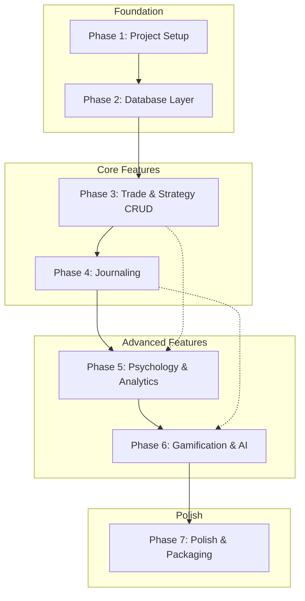

# Master Implementation Plan: TradingJournal Mac App Migration

## Document Metadata
- **Version:** 1.0
- **Created:** 2026-02-09
- **Target:** Electron + React + SQLite Mac Application
- **Source Project:** `/Users/allanbranstiter/Documents/GitHub/TradingJournal`
- **Target Project:** `/Users/allanbranstiter/Documents/GitHub/TradingJournal-Mac`

---

## 1. Executive Overview

### Purpose
This master plan coordinates the migration of "The Mindful Trader" trading journal from a Next.js + Supabase web application to a native Mac application using Electron + React + SQLite.

### Why This Migration?
- **Zero Hosting Costs**: Eliminate Railway/Supabase recurring fees
- **Full Data Ownership**: All trading data stays on user's machine
- **Offline Access**: No network dependency for core features
- **Privacy**: Sensitive trading data never leaves local device

### Scope Summary
| Current Stack | Target Stack |
|--------------|--------------|
| Next.js 15 | Electron 28+ |
| Supabase PostgreSQL | SQLite via better-sqlite3 |
| Supabase Auth | Not needed (single-user local) |
| Supabase Storage | Local filesystem |
| Server API Routes | Electron IPC handlers |

---

## 2. Phase Dependency Graph



### Phase Dependencies
| Phase | Depends On | Can Start After |
|-------|-----------|-----------------|
| 1. Project Setup | None | Immediately |
| 2. Database Layer | Phase 1 | Electron app window opens |
| 3. Core Features | Phase 2 | Database CRUD works |
| 4. Journaling | Phase 3 | Trade CRUD functional |
| 5. Psychology Analytics | Phase 3, 4 | Trades + journals exist |
| 6. Gamification & AI | Phase 3, 4, 5 | Analytics working |
| 7. Polish & Packaging | All phases | Feature complete |

---

## 3. Global Conventions

### 3.1 Project Structure
```
TradingJournal-Mac/
├── src/
│   ├── main/                    # Electron main process
│   │   ├── index.ts             # Main entry point
│   │   ├── preload.ts           # Context bridge
│   │   ├── database/
│   │   │   ├── connection.ts    # SQLite connection manager
│   │   │   ├── migrations/      # SQL migration files
│   │   │   │   ├── 001_initial_schema.sql
│   │   │   │   ├── 002_views.sql
│   │   │   │   └── ...
│   │   │   └── dal/             # Data Access Layer
│   │   │       ├── trades.ts
│   │   │       ├── strategies.ts
│   │   │       ├── journals.ts
│   │   │       └── ...
│   │   ├── ipc/                 # IPC handlers
│   │   │   ├── trades.ts
│   │   │   ├── strategies.ts
│   │   │   ├── journals.ts
│   │   │   ├── analytics.ts
│   │   │   ├── gamification.ts
│   │   │   └── settings.ts
│   │   └── services/            # Business logic
│   │       ├── ai.ts
│   │       └── export.ts
│   │
│   └── renderer/                # React frontend
│       ├── index.html
│       ├── main.tsx             # React entry
│       ├── App.tsx              # Root component
│       ├── components/          # UI components (copied from source)
│       │   ├── ui/              # Shadcn components
│       │   ├── dashboard/
│       │   ├── trades/
│       │   ├── psychology/
│       │   ├── analytics/
│       │   ├── import/
│       │   └── layout/
│       ├── hooks/               # React hooks (modified for IPC)
│       │   ├── useTrades.ts
│       │   ├── useStrategies.ts
│       │   └── ...
│       ├── lib/                 # Utilities
│       │   ├── utils/
│       │   ├── constants/
│       │   └── validation/
│       ├── types/               # TypeScript types
│       └── styles/
│           └── globals.css
│
├── resources/                   # App resources
│   └── icon.icns               # macOS app icon
│
├── package.json
├── tsconfig.json
├── tsconfig.main.json
├── tsconfig.renderer.json
├── vite.main.config.ts
├── vite.preload.config.ts
├── vite.renderer.config.ts
├── electron-builder.yml
└── README.md
```

### 3.2 Naming Conventions

| Element | Convention | Example |
|---------|------------|---------|
| Files | kebab-case | `trade-form.tsx` |
| Components | PascalCase | `TradeForm` |
| Hooks | camelCase with `use` prefix | `useTrades` |
| IPC Channels | namespace:action | `trades:getAll`, `trades:create` |
| Database Tables | snake_case | `pre_trade_journals` |
| TypeScript Types | PascalCase | `TradeWithRelations` |
| Constants | SCREAMING_SNAKE_CASE | `MAX_TRADES_PER_PAGE` |

### 3.3 IPC Communication Pattern

**Main Process (Handler):**
```typescript
// src/main/ipc/trades.ts
import { ipcMain } from 'electron';
import { tradesDAL } from '../database/dal/trades';

export function registerTradeHandlers() {
  ipcMain.handle('trades:getAll', async (_, filters) => {
    return tradesDAL.findAll(filters);
  });

  ipcMain.handle('trades:create', async (_, tradeData) => {
    return tradesDAL.create(tradeData);
  });

  ipcMain.handle('trades:update', async (_, id, updates) => {
    return tradesDAL.update(id, updates);
  });

  ipcMain.handle('trades:delete', async (_, id) => {
    return tradesDAL.delete(id);
  });
}
```

**Preload Script (Bridge):**
```typescript
// src/main/preload.ts
import { contextBridge, ipcRenderer } from 'electron';

contextBridge.exposeInMainWorld('electronAPI', {
  trades: {
    getAll: (filters) => ipcRenderer.invoke('trades:getAll', filters),
    create: (data) => ipcRenderer.invoke('trades:create', data),
    update: (id, data) => ipcRenderer.invoke('trades:update', id, data),
    delete: (id) => ipcRenderer.invoke('trades:delete', id),
    getById: (id) => ipcRenderer.invoke('trades:getById', id),
  },
  strategies: {
    getAll: () => ipcRenderer.invoke('strategies:getAll'),
    create: (data) => ipcRenderer.invoke('strategies:create', data),
    // ...
  },
  // ... more namespaces
});
```

**Renderer (Usage in Hook):**
```typescript
// src/renderer/hooks/useTrades.ts
export function useTrades(options = {}) {
  const [trades, setTrades] = useState([]);
  
  const fetchTrades = useCallback(async () => {
    // Replace fetch('/api/trades') with:
    const data = await window.electronAPI.trades.getAll(options);
    setTrades(data);
  }, [options]);
  
  // ...
}
```

### 3.4 Database Access Pattern

```typescript
// src/main/database/dal/trades.ts
import { db } from '../connection';
import { v4 as uuidv4 } from 'uuid';
import type { Trade, CreateTradeInput } from '../../../renderer/types';

export const tradesDAL = {
  findAll(filters?: TradeFilters): Trade[] {
    let sql = 'SELECT * FROM trades WHERE 1=1';
    const params: any[] = [];
    
    if (filters?.ticker) {
      sql += ' AND ticker LIKE ?';
      params.push(`%${filters.ticker}%`);
    }
    // ... more filters
    
    sql += ' ORDER BY entry_date DESC';
    
    if (filters?.limit) {
      sql += ' LIMIT ?';
      params.push(filters.limit);
    }
    
    return db.prepare(sql).all(...params) as Trade[];
  },
  
  create(data: CreateTradeInput): Trade {
    const id = uuidv4();
    const now = new Date().toISOString();
    
    const stmt = db.prepare(`
      INSERT INTO trades (id, user_id, ticker, direction, ...)
      VALUES (?, ?, ?, ?, ...)
    `);
    
    stmt.run(id, 'local-user', data.ticker, data.direction, ...);
    
    return this.findById(id)!;
  },
  
  // ...
};
```

### 3.5 Type Definitions

All TypeScript types from the source project should be preserved. They live in:
- Source: `lib/supabase/types.ts`
- Target: `src/renderer/types/index.ts`

Key types to migrate:
- `Trade`, `Strategy`, `PreTradeJournal`, `PostTradeJournal`
- `Gamification`, `PsychologyMetrics`, `TradingPlan`
- View types: `TradePerformanceSummary`, `StrategyPerformance`, etc.

### 3.6 Error Handling

```typescript
// Main process error wrapper
export function wrapHandler<T>(handler: () => T): T | { error: string } {
  try {
    return handler();
  } catch (error) {
    console.error('IPC Handler Error:', error);
    return { error: error instanceof Error ? error.message : 'Unknown error' };
  }
}

// Renderer error handling in hooks
const createTrade = async (data) => {
  try {
    const result = await window.electronAPI.trades.create(data);
    if (result.error) throw new Error(result.error);
    setTrades(prev => [result, ...prev]);
    toast({ title: 'Success', description: 'Trade created' });
    return result;
  } catch (err) {
    toast({ title: 'Error', description: err.message, variant: 'destructive' });
    return null;
  }
};
```

---

## 4. Database Schema Translation

### PostgreSQL → SQLite Changes

| PostgreSQL | SQLite | Notes |
|------------|--------|-------|
| `UUID` | `TEXT` | Store as UUID string |
| `TIMESTAMPTZ` | `TEXT` | Store as ISO 8601 string |
| `DECIMAL(10,4)` | `REAL` | SQLite uses 64-bit float |
| `INTEGER[]` / `TEXT[]` | `TEXT` | JSON-encoded array |
| `JSONB` | `TEXT` | JSON-encoded string |
| `gen_random_uuid()` | Application | Use `uuid` npm package |
| `NOW()` | Application | Use `new Date().toISOString()` |
| `REFERENCES ... ON DELETE CASCADE` | Manual | Handle in application |

### Single-User Simplification

Since this is a local single-user app:
- Remove `user_id` foreign key constraints (keep column for data portability)
- Use a constant `user_id = 'local-user'` for all records
- Remove Row Level Security (RLS) policies
- Remove authentication tables and references

---

## 5. Component Migration Strategy

### Direct Port (No Changes)
These components work unchanged in Electron:
- All `components/ui/*` (Shadcn components)
- `components/dashboard/MetricCard.tsx`
- `components/dashboard/EquityCurve.tsx`
- `components/trades/EmotionSelector.tsx`
- `components/trades/StarRating.tsx`
- Chart components (Recharts, lightweight-charts)

### Modify Data Fetching
Replace `fetch('/api/...')` with `window.electronAPI.*`:
- `components/dashboard/*` - Dashboard widgets
- `components/trades/*` - Trade forms and tables
- `components/analytics/*` - Analytics panels
- `components/import/*` - CSV import

### Replace Completely
- Authentication components (remove entirely)
- Server-specific components (middleware, etc.)

---

## 6. Human Oversight Checkpoints

### Checkpoint 1: After Phase 1
**Verify:**
- [ ] Electron app launches without errors
- [ ] Development hot-reload works
- [ ] Basic React component renders in window

**Manual Test:**
```bash
cd TradingJournal-Mac
npm run dev
```

### Checkpoint 2: After Phase 2
**Verify:**
- [ ] SQLite database file created at correct location
- [ ] All 8 tables created with correct schema
- [ ] Migrations run without errors
- [ ] Can perform basic CRUD from Node.js console

**Manual Test:**
```typescript
// Run in Electron main process debug console
import { db } from './src/main/database/connection';
db.prepare('SELECT * FROM sqlite_master WHERE type="table"').all();
```

### Checkpoint 3: After Phase 3
**Verify:**
- [ ] Can create a new trade via UI
- [ ] Trades display in table
- [ ] Can update and delete trades
- [ ] Strategy CRUD works

### Checkpoint 4: After Phase 4
**Verify:**
- [ ] Pre-trade journal form works
- [ ] Post-trade journal form works
- [ ] Journals link to trades correctly
- [ ] Emotion selectors function properly

### Checkpoint 5: After Phase 5
**Verify:**
- [ ] Psychology dashboard displays metrics
- [ ] Analytics charts render with real data
- [ ] Time-based analysis works
- [ ] All SQL views return correct data

### Checkpoint 6: After Phase 6
**Verify:**
- [ ] Streaks calculate correctly
- [ ] Badges award properly
- [ ] AI analysis sends request to OpenRouter
- [ ] API key stored securely in Keychain

### Checkpoint 7: After Phase 7
**Verify:**
- [ ] App builds without errors
- [ ] DMG file created
- [ ] App installs and launches on fresh Mac
- [ ] Code signing and notarization complete
- [ ] Data export/import works

---

## 7. Using the Phase Documents

### Document Format
Each phase document follows this structure:

1. **Prerequisites** - What must exist before starting
2. **Context** - State of the app entering this phase
3. **Objectives** - Numbered goals for the phase
4. **Files to Create** - Table of new files
5. **Files to Modify** - Table of changes
6. **Detailed Instructions** - Step-by-step tasks
7. **Success Criteria** - Checklist to verify completion
8. **Handoff to Next Phase** - What to pass forward

### AI Execution Guidelines

When executing a phase document:

1. **Read the entire document first** - Understand the full scope
2. **Check prerequisites** - Verify prior phases completed
3. **Create files in order** - Dependencies matter
4. **Run tests after each task** - Catch errors early
5. **Don't skip steps** - Each step builds on the last
6. **Report blockers immediately** - Don't try to work around

### Context Window Management

Each phase document is self-contained. If context window fills:
1. Save current progress
2. Note which task you completed last
3. Start new session with that phase document
4. Resume from the noted task

---

## 8. Technology References

### Electron Resources
- [Electron Docs](https://www.electronjs.org/docs/latest/)
- [electron-vite](https://electron-vite.org/) - Build tooling
- [electron-builder](https://www.electron.build/) - Packaging

### SQLite Resources
- [better-sqlite3](https://github.com/WiseLibs/better-sqlite3)
- [SQLite JSON1](https://www.sqlite.org/json1.html) - JSON functions

### Key Dependencies
```json
{
  "dependencies": {
    "electron": "^28.0.0",
    "better-sqlite3": "^9.2.0",
    "uuid": "^9.0.0",
    "keytar": "^7.9.0",
    "electron-store": "^8.1.0"
  },
  "devDependencies": {
    "electron-builder": "^24.9.0",
    "electron-vite": "^2.0.0",
    "@electron/rebuild": "^3.4.0",
    "vite": "^5.0.0"
  }
}
```

---

## 9. Risk Mitigation

### Common Issues and Solutions

| Issue | Solution |
|-------|----------|
| `better-sqlite3` build fails | Run `npm rebuild better-sqlite3` or use `@electron/rebuild` |
| IPC not working | Verify preload script loaded; check `contextIsolation: true` |
| Types mismatch after migration | Run TypeScript check: `npm run type-check` |
| Charts not rendering | Ensure Recharts/lightweight-charts properly bundled |
| Database locked | Use WAL mode; ensure single connection |
| Keychain access denied | Request Keychain access in macOS permissions |

### Rollback Strategy

If a phase introduces critical bugs:
1. Git tag before each phase: `git tag phase-N-start`
2. Revert to tag: `git checkout phase-N-start`
3. Create bug report with reproduction steps
4. Re-attempt phase with fixes

---

## 10. Phase Documents Index

| Document | Description | Est. Files |
|----------|-------------|------------|
| `01_PHASE_PROJECT_SETUP.md` | Electron scaffold, Vite config, Tailwind setup | ~15 |
| `02_PHASE_DATABASE_LAYER.md` | SQLite schema, migrations, DAL | ~12 |
| `03_PHASE_CORE_FEATURES.md` | Trade & Strategy CRUD | ~20 |
| `04_PHASE_JOURNALING.md` | Pre/Post Trade Journals | ~15 |
| `05_PHASE_PSYCHOLOGY_ANALYTICS.md` | Psychology dashboard, charts | ~18 |
| `06_PHASE_GAMIFICATION_AI.md` | Streaks, badges, AI coach | ~12 |
| `07_PHASE_POLISH_PACKAGING.md` | Settings, export, DMG creation | ~10 |

---

## 11. Quick Start for AI Executor

1. **Clone source project** (if not already):
   ```bash
   cd /Users/allanbranstiter/Documents/GitHub
   # Source already exists at TradingJournal
   ```

2. **Create target directory**:
   ```bash
   mkdir TradingJournal-Mac
   cd TradingJournal-Mac
   ```

3. **Begin with Phase 1**:
   - Open `01_PHASE_PROJECT_SETUP.md`
   - Follow instructions sequentially
   - Verify success criteria before proceeding

4. **Continue through phases**:
   - Each phase depends on prior phases
   - Don't skip phases
   - Run human checkpoints when indicated

---

## Document Changelog

| Version | Date | Changes |
|---------|------|---------|
| 1.0 | 2026-02-09 | Initial master plan created |

---

**Next Document:** `01_PHASE_PROJECT_SETUP.md`
